# VectorSearch


## DataSet

[Hugging Face C4](https://huggingface.co/datasets/c4) </br>

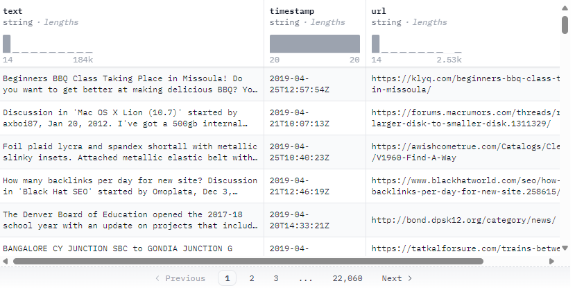
</br>

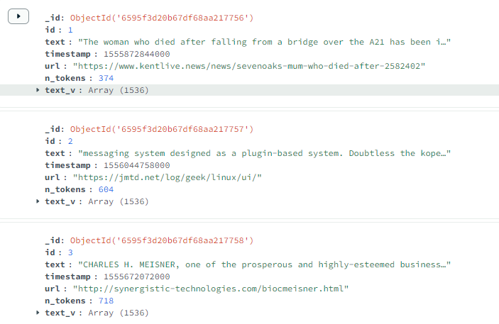
</br>

## Azure PostgreSQL Flexible Server

Reference Doc: </br>
[How to enable and use pgvector on Azure Database for PostgreSQL - Flexible Server](https://learn.microsoft.com/en-us/azure/postgresql/flexible-server/how-to-use-pgvector) </br>
[https://github.com/pgvector/pgvector](https://github.com/pgvector/pgvector) </br>

### Create Table

```sql
CREATE TABLE IF NOT EXISTS public.T_IVF_COS
(
    id bigint,
    text_v vector(1536)
)
TABLESPACE pg_default;
```

### Create Indexes

```sql
CREATE INDEX IVF_COS_IDX ON T_IVF_COS USING ivfflat (text_v vector_cosine_ops) WITH (lists = 365);
CREATE INDEX IVF_IP_IDX ON T_IVF_IP USING ivfflat (text_v vector_ip_ops) WITH (lists = 365);
CREATE INDEX IVF_L2_IDX ON T_IVF_L2 USING ivfflat (text_v vector_l2_ops) WITH (lists = 365);

SELECT phase, round(100.0 * tuples_done / nullif(tuples_total, 0), 1) AS "%" FROM pg_stat_progress_create_index;
```

```sql
CREATE INDEX HNSW_COS_IDX ON T_HNSW_COS USING hnsw (text_v vector_cosine_ops);
CREATE INDEX HNSW_IP_IDX ON T_HNSW_IP USING hnsw (text_v vector_ip_ops);
CREATE INDEX HNSW_L2_IDX ON T_HNSW_L2 USING hnsw (text_v vector_l2_ops);

SELECT phase, round(100.0 * blocks_done / nullif(blocks_total, 0), 1) AS "%" FROM pg_stat_progress_create_index;
```

### Query Vector

```sql
SELECT ID, 1 - (text_v <=> '[Embedding]') AS cosine_similarity 
FROM T_IVF_COS
ORDER BY cosine_similarity DESC
LIMIT 5;

SELECT ID, (text_v <#> '[Embedding]') * -1 AS inner_product 
FROM T_IVF_IP
ORDER BY inner_product DESC
LIMIT 5;

SELECT ID, text_v <-> '[Embedding]' AS distance 
FROM T_IVF_L2
ORDER BY distance
LIMIT 5;
```

```sql
SELECT ID, 1 - (text_v <=> '[Embedding]') AS cosine_similarity 
FROM T_HNSW_COS
ORDER BY cosine_similarity DESC
LIMIT 5;

SELECT ID, (text_v <#> '[Embedding]') * -1 AS inner_product 
FROM T_HNSW_IP
ORDER BY inner_product DESC
LIMIT 5;

SELECT ID, text_v <-> '[Embedding]' AS distance 
FROM T_HNSW_L2
ORDER BY distance
LIMIT 5;
```

### Results

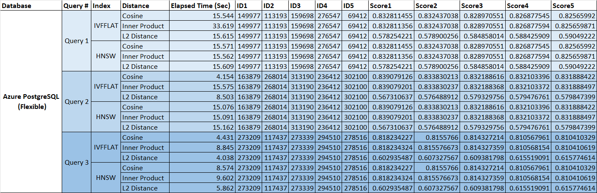
</br>

## Azure SQL Database

Reference Doc: </br>
[Vector Similarity Search with Azure SQL database and OpenAI](https://devblogs.microsoft.com/azure-sql/vector-similarity-search-with-azure-sql-database-and-openai/) </br>
[SQL SERVER VECTOR SEARCH](https://www.architecture-performance.fr/ap_blog/semantic-vector-search-with-sql-server/) </br>
[azure-sql-db-openai](https://github.com/Azure-Samples/azure-sql-db-openai) </br>

### Create Table with Column Store Index

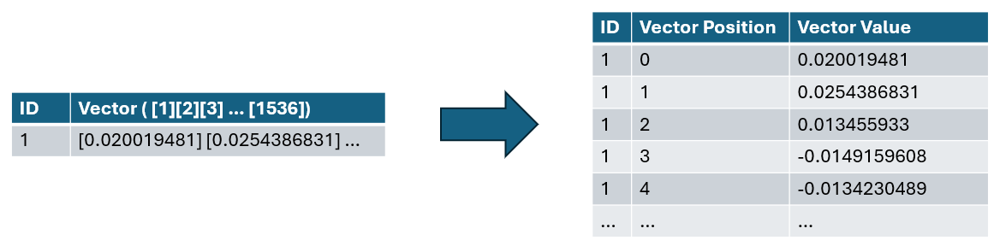

```sql
CREATE TABLE [dbo].[dfv_sum](
	[id] [bigint] NULL,
	[pos] [int] NOT NULL,
	[col] [float] NULL
) ON [PRIMARY]
GO

CREATE CLUSTERED COLUMNSTORE INDEX [CCIDX] ON [dbo].[dfv_sum] ORDER ([id])WITH (DROP_EXISTING = OFF, COMPRESSION_DELAY = 0) ON [PRIMARY]
GO
```

### Query Embedding

```sql
declare @inputText nvarchar(max) = 'Bridge Over Trouble Water';
declare @retval int, @response nvarchar(max);
declare @payload nvarchar(max) = json_object('input': @inputText);
exec @retval = sp_invoke_external_rest_endpoint
    @url = 'Deployment URL',
    @method = 'POST',
    @headers = '{"api-key":"Your API Key"}',
    @payload = @payload,
    @response = @response output;

select 
    cast([key] as int) as [vector_value_id],
    cast([value] as float) as [vector_value]
into    
    #QRY1
from 
    openjson(@response, '$.result.data[0].embedding');
```

### Calculate Cosine Similarity

```sql
SELECT 
    SUM(a.col * b.vector_value) / (  
        SQRT(SUM(a.col * a.col)) * SQRT(SUM(b.vector_value * b.vector_value))   
    ) AS cosine_similarity
FROM
    dbo.dfv_sum a, #QRY1 b
WHERE
	a.id = 1;
```

### Query Cosine Similarity

```sql
select top (50)
    v2.id, 
    sum(v1.[vector_value] * v2.col) / 
        (
            sqrt(sum(v1.[vector_value] * v1.[vector_value])) 
            * 
            sqrt(sum(v2.col * v2.col))
        ) as cosine_similarity
from 
    #QRY1 v1
inner join 
    dbo.dfv_sum v2 on v1.vector_value_id = v2.pos
group by
    v2.id
order by
    cosine_similarity desc;
```

### Results

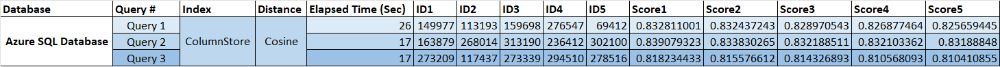
</br>

## Azure Cosmos MongoDB vCore

Reference Doc: [Use vector search on embeddings in Azure Cosmos DB for MongoDB vCore](https://learn.microsoft.com/en-us/azure/cosmos-db/mongodb/vcore/vector-search) </br>

### Vector Indexes

```json
db.runCommand({
  "createIndexes": "C4_IVF_COS",
  "indexes": [
    {
      "name": "IVF_COS_IDX",
      "key": {
        "text_v": "cosmosSearch"
      },
      "cosmosSearchOptions": {
        "kind": "vector-ivf",
        "numLists": 365,
        "similarity": "COS",
        "dimensions": 1536
      }
    }
  ]
});
```


```json
db.runCommand({ 
    "createIndexes": "C4_HNSW_COS",
    "indexes": [
        {
            "name": "HNSW_COS_IDX",
            "key": {
                "text_v": "cosmosSearch"
            },
            "cosmosSearchOptions": { 
                "kind": "vector-hnsw", 
                "m": 16, 
                "efConstruction": 64, 
                "similarity": "COS", 
                "dimensions": 1536 
            } 
        } 
    ] 
});
```

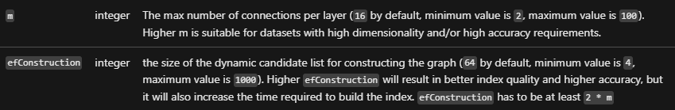

### Vector Search

```js
const queryVector1 = 
[-0.0064546848,-0.0299023837,0.0000524017,-0.0029014491,-0.0133283753,0.0073891343,0.0093245422,-0.0042731944,-0.0088057732,-0.0090718083,0.0045026499,0.0146718547,-0.0202852022,-0.0027351768,0.0076817735,0.0144989314,0.0253132731,-0.0010009584,-0.006162046,-0.0301152114,-0.0375109985,0.0065943534,0.0057131113,-0.0003331678,-0.024900917,0.0094376076,0.0221474506,-0.0356487483,0.0119782453,-0.0171858892,0.0040902947,-0.0048850756,-0.0324829258,-0.0281199459,-0.0121046128,-0.0228790473,-0.017545037,-0.0049216556,0.0300354008,-0.0151640205,0.0121046128,-0.0110737253,-0.0140067665,-0.0251270477,-0.0113198077,0.0216552857,-0.0119516421,-0.0015928872,-0.0239298884,0.0153502449,0.0382824987,-0.0100428378,0.0024425378,-0.0338397101,0.0113065066,0.0084133707,-0.0093311928,0.010515051,-0.0023194966,0.0037577506,-0.0063349688,-0.0112666013,-0.0119715948,-0.0075554065,-0.0189284217,0.010189157,0.0037943304,-0.0041800817,0.0247146934,0.0029064373,0.0023527509,0.0285722073,0.0015122452,-0.0019536978,0.0210567061,-0.0261512846,-0.0272952355,-0.0106613701,0.0085995961,0.0167336296,0.0084067201,-0.0227460302,-0.0114062699,0.0015804168,0.0125568733,-0.0004543386,-0.016919855,0.0060589574,-0.0089853471,-0.0259783603,0.0068171583,0.0382292941,0.0042731944,0.009803406,0.0163611788,-0.0066874661,-0.0142328963,0.0426188782,0.0036380347,-0.0499614552,-0.0076950751,-0.0069834301,0.0172257945,-0.0006122972,-0.0248344094,-0.0262310952,0.003511668,0.0235175323,0.0085330866,0.0064081289,0.003707869,0.0179706942,0.0077615841,-0.0106613701,-0.0140599729,-0.0177445635,-0.0181702208,-0.024648184,0.0003685007,-0.0065211938,0.0117720682,0.0055867443,0.0109872641,-0.020005865,-0.0085397381,0.018077109,-0.0262310952,0.0083468622,0.0113198077,0.0203650128,0.0286254138,0.0006143756,0.0115924943,-0.0257522315,-0.0167868361,0.0056565786,-0.0110737253,0.0051112059,-0.0045159515,-0.0103288265,0.000405704,0.0253265742,-0.0140599729,-0.0133948848,0.0129692275,0.0084665781,-0.0001775994,0.0097568501,0.0093844002,-0.0115392869,0.0011763754,-0.0212429296,0.0126034291,0.0029064373,-0.0112732518,0.0195802078,-0.0148979845,0.009670388,-0.0168533456,0.0182766356,0.0204182193,0.0176780559,0.0271755196,0.0058827088,0.0097701512,0.0211365167,-0.0010267305,-0.0060390043,-0.0200324692,-0.0136476178,-0.0071031465,0.0248211063,-0.0123706479,0.0239697937,-0.0082803527,0.0075620576,0.0039107208,-0.0041834074,-0.028785035,-0.0047819871,-0.0314453878,0.0215089656,0.0086993594,0.0202852022,-0.0085064834,0.0059857974,0.013807239,-0.0079611102,0.0033686738,0.0106347669,0.0023095203,0.0206975583,-0.0232781004,0.0081872409,-0.6733888984,-0.0385219306,-0.0195137002,-0.0148979845,0.0036646381,0.0033470583,0.0133549795,0.0286254138,-0.0116390502,0.015230529,-0.0040071588,0.024528468,0.0031043012,0.0047221291,-0.0112532992,-0.0127763525,-0.0007956122,-0.0164542925,-0.0009095087,-0.0082404474,-0.0036081057,0.0203251075,-0.0199925639,-0.0014640263,0.0096304826,0.0030195022,0.0177179612,-0.021163119,-0.0235574376,-0.0007997691,-0.0110138673,0.0221474506,0.0088855838,-0.0075288028,0.0484450534,0.0152039258,-0.0068304599,0.0250472371,0.0367394947,0.0410492681,-0.0050846022,-0.0120514054,0.01471176,0.0032389816,0.0102091096,0.0104485424,0.036127612,-0.0015546447,0.0139801623,0.0007527972,0.0128229083,0.0031708099,-0.0026237746,0.0191545524,-0.0075687082,-0.0209236871,0.0170129668,0.0130024822,0.0024026325,-0.0054138214,-0.0224134866,0.0044993246,-0.0096038794,-0.0058295014,-0.027880514,0.003110952,-0.0167203266,0.0054603773,0.0161483511,0.0269227866,0.0189284217,0.0162414629,-0.0051078806,0.0021831533,0.0171592869,0.0203517117,0.0231583845,0.0076884241,-0.0051378096,-0.0048218924,-0.0005125339,-0.0104219383,-0.012975879,-0.0046655964,0.0339195207,0.0133283753,-0.0178908836,-0.0003009526,0.0151773216,-0.0193407759,-0.011552589,0.021695191,-0.0077948384,0.0044328156,-0.0022829166,0.0100760926,-0.010395335,0.0234111194,0.0258054379,-0.0198994502,0.0055800932,-0.0327489637,-0.0100162346,-0.0035216443,0.0126699377,-0.0082936548,0.00780814,-0.0066375844,0.0314187855,-0.0164941978,0.014073275,-0.0064380579,0.0073425784,-0.0307803005,0.022852445,-0.02349093,0.0158823151,-0.0061653713,0.0165740084,-0.0501210764,-0.0049815136,0.0262843017,-0.0127763525,-0.00129526,-0.0060223774,0.0075288028,0.0027601176,-0.0078280931,-0.004160129,0.0022130823,-0.0051411348,0.021947924,0.0303812474,-0.0051045548,0.010588211,0.0074622943,0.0062817619,-0.0073359273,0.0193806812,-0.0260315686,-0.0100428378,0.0184495579,0.0061188154,0.0095107667,-0.0084466254,-0.0313921832,-0.0159355234,-0.0226662196,-0.0314187855,-0.0099962819,-0.0050480226,-0.0168001391,-0.013421488,-0.0022629639,-0.012902719,-0.0216153804,0.0255261008,-0.0168932509,-0.0202852022,-0.0217616986,-0.0028548928,0.0016377807,-0.028013533,-0.0134414406,0.002698597,-0.0148846833,0.016121747,0.0116723049,-0.0117986714,-0.0056000459,0.0079012522,-0.0139801623,-0.0069967322,0.0007939495,0.0012495352,0.0194471907,-0.015749298,0.0033902891,0.0070100338,-0.0026021593,-0.0070964955,0.0132020088,-0.025951758,-0.014326009,0.0271622185,0.0163345765,0.0313389748,-0.0022413486,-0.0074955486,0.0298757795,-0.0126366839,0.0324829258,0.0110604232,0.0019187806,0.0051378096,0.0076485188,-0.0096238321,0.0050480226,0.0211897232,0.0411290787,0.0278273076,-0.0029446797,0.0198861491,-0.0143393101,0.0141397836,-0.0127031924,-0.0101825064,-0.021176422,0.0359679908,0.0172124933,0.011479429,-0.0162813682,-0.0280401353,-0.0240762066,-0.0028731828,0.0192742683,-0.0100893937,0.0158823151,-0.005999099,-0.0142461983,-0.0006085561,0.01193834,0.0015006062,0.0148314759,-0.0080608735,-0.016919855,0.0288914498,0.014073275,0.0156428833,0.0007897927,-0.0010092719,-0.0003454304,0.0155497715,0.0166139137,-0.0001817562,-0.0261113793,0.00105084,-0.0146452514,0.0293171052,-0.0084865307,0.0329617895,-0.0012071359,0.0169597603,-0.0108475955,0.0051378096,-0.0037743778,0.0073226257,0.0231583845,-0.0088323765,-0.0085596908,0.0013659258,-0.0041202237,-0.0222272612,0.0177844688,0.0177977718,-0.0052941055,0.0098832166,0.0173588134,0.0184761621,0.0309399217,-0.0101226484,0.0216419827,0.0162813682,0.0156428833,0.0053739161,-0.0116989082,-0.0138205411,-0.006138768,-0.0278007034,0.0127231451,0.0012761387,-0.0260581709,0.0265370347,-0.0224932972,0.0126366839,-0.0036513365,0.0234510247,0.0177046582,0.0112133939,-0.0195270013,-0.0289446563,-0.0171459839,0.0221740548,0.0088722818,-0.0129891802,-0.0122775361,-0.0147649674,0.016002031,-0.0175982453,0.0259650592,0.0195669066,0.0173322093,0.0086261993,0.0022479994,-0.0061886497,-0.0074955486,0.006035679,-0.0107544828,0.0064746374,-0.0036679637,0.0022995439,0.001465689,0.0073093236,-0.0156827886,0.0247013904,0.0032190289,-0.0015737659,0.0038275849,0.0036313839,-0.0168001391,-0.0004177588,-0.0162813682,-0.0213227402,-0.0236904565,-0.0106214648,-0.0058161998,0.0145255355,-0.0187954046,0.0132020088,0.0047287801,-0.0145654408,-0.0176780559,-0.0366330817,0.0146186473,0.1232276186,0.0114993816,0.0041634548,0.0053539635,0.0090585072,-0.0067240456,-0.0208704807,-0.0442949012,0.0157625992,-0.0037012182,0.026204491,-0.0169863626,0.0250206329,-0.0083867675,0.0182500314,0.018968327,-0.0156428833,-0.0347708315,0.0150177004,-0.0328819789,-0.0207374636,-0.0045658331,0.0050014663,0.0231982898,-0.0079079038,-0.0192609653,-0.0008912187,0.0040969457,0.0231317822,0.0149245886,-0.0168666467,0.0020384965,0.0070698918,-0.0092114769,0.0039938572,0.0212030243,0.0263774134,0.0045325789,0.0218681134,-0.0137939379,0.0275346674,-0.0073891343,0.0200457703,-0.0210301019,0.011552589,-0.0328021683,-0.0003685007,0.0213759486,0.0232514981,-0.0149112865,0.0272952355,0.0035050169,-0.030195022,-0.0080409208,0.0156694874,0.011226696,0.0135877598,-0.0069036195,-0.0059791463,0.0147250621,-0.0039838809,-0.0181835219,0.0075021996,-0.0081007788,0.026590243,-0.0278273076,-0.0222538654,-0.0048318687,-0.0080010155,-0.0225731079,0.0085463887,-0.0209502913,-0.022839142,-0.0040171351,0.0277740993,-0.0032173661,0.0064214305,-0.0239697937,-0.008586294,-0.0011813636,0.0033986028,-0.0172790028,0.0198329426,0.0048385197,-0.0142461983,0.0085663414,0.0013925292,-0.006704093,0.0014457364,0.0243688468,0.0023893309,0.0153236417,-0.0016693724,-0.0249674264,0.0190348364,-0.0025339876,0.0061953003,0.0195403025,-0.0017658103,0.0106414175,0.0338397101,-0.0300620049,-0.0247545987,-0.0370321348,0.0111934412,0.0062418566,-0.0012960915,0.013228612,-0.0189417228,0.0118917841,0.0025206858,-0.0193939842,0.0148580791,0.004931632,0.0061786734,-0.0060523064,-0.0009136655,-0.0034684371,-0.0088057732,-0.0134547427,-0.0017059522,-0.0220277347,0.0208039712,0.0051012295,-0.0293703135,0.0292106923,0.0143925175,-0.0311793536,-0.0219745282,-0.0027734195,0.0081207315,0.0193008706,-0.0046157148,0.0077549331,-0.006132117,-0.042326238,-0.0044660699,-0.0032456324,0.0035615496,-0.0112399971,-0.0018971652,0.010515051,-0.0050214189,-0.0320572704,-0.0168533456,-0.02349093,-0.0013825529,-0.0093710981,-0.0140067665,0.0223070718,0.0020634374,0.0000065762,-0.0113198077,0.0306472834,-0.0118119735,-0.0337865017,-0.0336800888,0.0007694244,0.0281731542,0.0178775825,0.0186224803,0.0167336296,0.0149378898,0.0102290623,-0.0151773216,-0.0078546964,0.0207374636,-0.0079145543,-0.0360478014,0.0072428151,0.0139934644,0.02942352,0.0186889898,-0.0004505975,0.0053938688,0.0067606256,-0.0160419364,-0.0066375844,-0.01755834,-0.0124837132,0.0073159747,-0.0053140582,-0.0069701285,-0.014073275,-0.008320258,-0.014192991,0.0284923967,-0.0298757795,0.0027185497,-0.0041035968,0.0374577902,-0.0123639973,0.0040171351,0.0011206743,0.0073758326,-0.0169863626,0.0007744125,-0.0060090753,-0.0094841635,0.0147782685,0.0015987067,-0.0137939379,-0.0210168008,-0.0029380289,-0.027880514,0.0299023837,-0.018715594,-0.0070299865,0.0110404706,-0.0191678535,-0.0040071588,-0.0252201594,-0.0273484439,-0.0154167535,0.0212429296,0.0153768482,-0.0039306735,0.0331746191,-0.0122442814,-0.0298757795,-0.0227327291,0.0104418909,0.0225465037,0.0125103164,0.032137081,0.0105416542,0.00030698,-0.0091117136,0.0263508111,0.0316582173,-0.0100095831,0.0124903638,-0.0080342703,0.0086328499,0.0165873095,-0.028785035,0.0105749089,-0.0113863172,-0.0231184792,0.0195403025,-0.0108608967,-0.0146851568,-0.0043729576,-0.0219878294,-0.0072095604,0.0418473743,-0.0244220532,-0.0020817274,-0.0084266728,-0.027614478,-0.0222804677,0.0325095318,-0.0117720682,0.0144058196,-0.0199659597,-0.010528353,-0.0166804213,0.0210168008,-0.0168932509,-0.0182234272,-0.0030577448,0.0516906865,-0.0249541253,-0.0006921078,0.0097102933,0.003737798,0.0020285202,-0.0072760694,-0.0022529876,0.0277208928,0.0059724958,-0.0186224803,0.0060124011,0.0130024822,0.0166272148,0.0112599498,-0.004316425,-0.0328819789,-0.0052542002,-0.0108209914,0.0096371341,0.0052309218,-0.0203251075,-0.0050879279,0.0071430518,-0.0136476178,-0.0149378898,-0.009031903,-0.0151507184,-0.0254462902,-0.0372715667,-0.0329883955,-0.0015488251,0.0416611508,-0.0201654863,-0.0053406614,0.0077549331,0.024528468,-0.0163212735,0.0152438311,0.0065744007,0.0226529185,-0.0162813682,0.0244486574,0.0189550258,-0.0160419364,0.0070765428,-0.0154566588,0.0011489405,-0.0298757795,-0.0088190753,0.0082470989,-0.0059492174,-0.0065677501,0.0022845794,-0.0159754287,-0.0009510767,-0.0272420291,-0.0167469308,0.0382558964,-0.0084133707,0.0033187922,0.0258054379,-0.0134414406,0.0103155244,0.0081805894,-0.0101559032,0.0063515962,-0.0122243287,-0.0034085792,0.0272287279,0.0255926102,-0.0147782685,-0.0270025972,0.0078214416,-0.0002668668,-0.0127364472,0.0061520697,-0.0125236185,-0.0124637606,0.0056000459,0.0022446741,0.012709843,-0.0007486403,-0.0115658911,-0.0210301019,-0.021814907,-0.0000069562,0.0010042838,-0.0146984579,0.0134879965,0.0181436166,0.0051644132,-0.0051610875,-0.0244220532,0.0080409208,-0.0337865017,-0.0113730151,0.0180372037,0.0147915706,0.0102822697,-0.0058261761,0.0185692739,0.0128960684,-0.0112932045,0.0341323465,0.0007719185,-0.0085397381,-0.0020418221,0.0171459839,-0.00339694,0.0037976559,-0.0129891802,-0.0081074303,0.0057563419,0.0018672362,-0.0100494884,0.0146053461,-0.01471176,-0.0170528721,0.0079012522,-0.0321104787,0.0001489175,-0.0108143408,0.0108675482,-0.0330416001,-0.0113464119,0.0096637374,-0.0061354423,-0.0132552162,0.0235840417,0.0196068119,0.0023244848,0.005546839,-0.020271901,-0.0066109807,-0.0083601633,-0.0145388367,-0.0053805667,0.016919855,0.0083003053,0.0101359505,0.0087326132,0.0117787188,0.0088323765,0.0138205411,-0.0202985033,-0.0264838282,-0.0108608967,-0.0257655326,-0.0016419375,-0.0293171052,-0.0069036195,-0.0136742219,0.0035316206,-0.0176780559,-0.0084266728,-0.0043496797,0.0257788338,0.0178775825,-0.0222538654,-0.0017824374,-0.0065112174,-0.008586294,-0.0105416542,-0.0248211063,0.0039173719,-0.0297959689,-0.0006571907,0.0023444374,0.0082803527,-0.0083335601,0.0127364472,0.0066276081,0.0017109404,0.0163611788,0.2345368415,-0.0024874313,-0.0207640659,0.0046057384,0.0007473933,0.0036014549,0.0182633325,0.0061088391,-0.0123772994,0.0011622424,-0.0219346229,-0.0020135557,-0.0217350964,-0.0032190289,-0.0149511918,-0.0048817503,-0.0499614552,-0.039506264,-0.0196999237,-0.0123440446,0.0046057384,-0.003707869,-0.0024458633,-0.0273484439,0.0081938915,0.0036147565,0.0016045263,0.0093644476,0.0077349804,0.0271223132,-0.0055734427,-0.0055036084,0.0028947981,0.0240629055,-0.0018007274,-0.0086661046,0.0195536055,-0.0229056515,0.0021765025,-0.0182234272,-0.0000544541,0.0156827886,0.0098300092,0.0213626456,0.0032489579,0.012649985,-0.0066375844,-0.0093777496,0.0339727253,0.0312325601,-0.0126699377,0.0080342703,0.0078879511,0.0400649384,-0.0010167542,0.0075088502,0.012191074,-0.0098898672,-0.0081207315,-0.0061720223,0.0060257027,0.0191678535,-0.0104086371,0.0052542002,-0.0230519716,0.0178775825,-0.0230918769,-0.0125302691,0.0031192657,-0.0287052244,-0.005583419,-0.0155231683,-0.0051045548,0.0160552394,-0.0315251984,-0.0183431432,0.0229322556,0.0155763747,0.0196201131,0.0221075453,-0.0190481376,0.0062684603,-0.0069967322,-0.0322434939,-0.017545037,-0.0305142645,0.020657653,-0.0013667571,0.008839028,0.0112200445,0.0322967023,-0.0021898043,-0.0131421508,0.0195802078,0.0031891,0.0176381506,-0.0184229538,-0.0049881646,-0.002746816,0.0198728479,-0.0258054379,-0.0099896304,0.0008662779,0.0029662952,-0.0309399217,-0.0173721146,0.0026753189,0.0154300556,-0.0108475955,-0.0189284217,-0.0324563235,-0.0056964839,0.0072162114,-0.0043762829,-0.0037943304,0.020271901,0.0164808948,-0.0270025972,-0.0048218924,-0.0110870274,-0.0030577448,-0.0275080651,-0.0096903406,0.0153901502,-0.0018190173,-0.004865123,0.0232514981,-0.0010458519,0.0124903638,-0.0488973148,0.0136609199,-0.0264306217,0.0084998328,-0.0212828349,-0.0078280931,0.0298225731,-0.0040071588,-0.0012545234,-0.0199260544,-0.0012877778,0.0100893937,-0.0176248476,-0.011745465,0.0140067665,0.0018589227,-0.0310463365,0.0173854157,-0.0199127533,-0.0013268518,-0.0131488014,-0.0010957335,0.0080010155,0.0112399971,0.0049449336,0.0216419827,-0.0235308353,-0.0141264824,-0.0356487483,-0.0035515733,0.0412887,-0.0507329591,0.0098965187,0.0151241152,-0.0241028108,-0.003373662,-0.0025107095,-0.1722845584,0.0182899367,0.0155098662,-0.0057064602,0.0233047046,0.0143526122,0.0258320421,-0.0026271001,-0.0184362568,0.023743663,0.0025040586,0.0126300324,-0.0200856756,0.0208438765,-0.0198994502,-0.0140998783,-0.0174652264,0.0078879511,0.0032223542,-0.0044893483,0.0123839499,-0.0044760462,0.0228657462,-0.0019204434,0.0205645394,0.0044527682,-0.0230652727,0.0239830948,-0.0041202237,0.0107079269,-0.0086794067,0.0067140693,0.0116057964,-0.0058926851,0.009031903,0.0124504585,-0.0013892038,-0.0087658679,-0.0175051317,0.0219878294,0.0064546848,0.029157484,0.0239431895,0.0312857665,-0.0254861955,0.0323765129,0.0104950983,-0.009743548,0.0009369436,-0.0117321629,-0.0078347437,-0.0273484439,-0.0117853703,0.0025871948,0.0004668091,0.0108342934,0.0082936548,0.0107411807,-0.0065744007,-0.0237170588,-0.0141131803,-0.0055501643,0.0081007788,0.0009635471,-0.0363936499,0.0061354423,-0.0130822929,0.0035382714,-0.0113663645,0.0026586917,-0.0152438311,-0.0393466428,-0.0077948384,-0.0271356143,0.0009959702,0.0115991449,0.0020651,0.0084000695,-0.0120048495,-0.0007561226,-0.0091915242,0.0285456032,-0.0207241606,-0.0205113329,0.0174785294,-0.0001869523,-0.0194471907,-0.0011838577,-0.0014623635,-0.0017641475,0.0322967023,-0.0368193053,0.0084067201,-0.0148181738,0.0121378675,0.0099031692,0.0303280409,-0.0076352172,0.0085663414,0.0140998783,-0.0090186018,0.003874141,-0.0115060331,0.0028432538,0.0267365612,0.0303812474,0.0251270477,-0.0049549099,0.0217883028,0.0014748339,-0.0158025045,-0.0159089193,0.0099630272,0.0153768482,0.0235707406,0.0243023373,0.0046290169,-0.0047055017,0.0069568269,0.0075886608,0.0612413585,0.0007428208,-0.0193806812,-0.0045525315,0.0044261646,-0.0018522717,-0.0777887627,0.0010225737,0.0140067665,0.0045857858,-0.0012428843,0.0125435712,-0.0165740084,-0.0019869523,-0.0091516189,0.0184761621,0.0071364008,-0.0092646843,-0.0002672825,-0.0045126262,0.0259251539,-0.0039240229,-0.0196068119,-0.0051810401,-0.0074290396,0.0165341031,-0.0115658911,0.016121747,-0.0311527494,-0.0199925639,0.0210833084,-0.0111934412,-0.0470084623,0.005427123,0.0282529648,0.0006721552,-0.009357797,0.0010358755,-0.00341523,-0.0182633325,0.0061055133,-0.0129559264,-0.0043463539,-0.007296022,0.0205645394,-0.0274282545,-0.0007249466,0.020258598,0.0285988096,-0.0155630736,0.0084133707,-0.0168533456,-0.0232115928,0.0303280409,0.0057363892,-0.0114594763,-0.004931632,0.0082470989,0.0005029733,-0.007874649,0.0420336016,0.0003098897,0.0089321397,0.0017392067,-0.0302748326,0.0138338432,-0.0233446099,-0.0284391884,0.0024325615,0.0314719938,0.0133948848,0.0085330866,0.0158291087,-0.0045192773,0.0050713005,-0.0008587957,-0.0308867153,0.014192991,-0.0114328731,0.0378834456,-0.0292905029,0.0140998783,-0.0043729576,-0.0246215798,0.0165873095,0.0059824721,-0.0052275965,-0.0174918305,0.0073159747,-0.0205113329,0.0248477105,0.0100561399,-0.0080010155,0.0319508575,0.0274814609,-0.0096238321,0.0255261008,0.0279603247,0.0151108131,-0.038974192,0.008646152,0.0077150278,0.0010525028,-0.0053572888,-0.0155231683,0.0081007788,-0.0196999237,0.004835194,-0.0752880275,0.0271223132,0.0081207315,-0.0008870619,0.0154566588,-0.005576768,0.0030643959,-0.0119782453,-0.0232381951,-0.0006093874,-0.0204315223,0.0353029035,0.0113929678,0.0048551466,0.002179828,-0.0051544369,-0.0089653945,0.0028715201,0.0111934412,0.006102188,-0.0212030243,-0.0101359505,0.0101226484,-0.0048850756,-0.0107345302,0.0019936031,-0.0057895961,0.0337865017,-0.0116390502,-0.004233289,0.0053340108,-0.0266301483,-0.0002548121,0.0293437093,-0.008646152,-0.0079478091,0.0179174878,0.0187554993,0.0263907164,0.0251935571,-0.0067805783,-0.012071358,0.0205778424,-0.0122775361,-0.0164941978,-0.0011131921,-0.0102689685,0.0286254138,0.0083867675,0.0012919346,0.0044594193,0.0297959689,0.0153768482,-0.0025971711,-0.0137673337,-0.0101426011,0.0020218694,-0.0151906237,0.0040404131,-0.0077748857,0.015097511,0.0086395014,-0.0049848389,0.0113996183,0.0050081173,0.0009452572,0.0111202812,-0.012916021,0.0001591017,-0.0232781004,-0.0103687318,0.0014681831,0.0094509088,0.0187288951,-0.005390543,-0.0034019281,-0.004871774,0.0009568962,-0.0090585072,0.0002442122,0.0280667394,0.0136742219,-0.0352230929,0.0127297956,-0.0125967786,0.0125236185,0.0122309793,0.0107877376,0.0101026958,-0.0002425495,-0.003403591,0.0027717568,-0.0027218752,0.0127896536,0.0087658679,0.030195022,-0.028785035,0.0185692739,0.0302748326,0.0005703135,-0.035489127,0.0036879163,-0.0089254891,-0.0261512846,-0.0431243442,0.024009699,0.0005075457,-0.033946123,-0.0108941514,0.0103886845,-0.0121777728,-0.0102490149,-0.0039938572,0.0118984347,-0.0056333006,0.0112399971,0.0120115001,-0.0106214648,-0.0071430518,0.0101825064,0.0168400444,0.0196733214,0.0180105995,0.0022596386,0.0166671202,-0.0075487555,0.0077948384,-0.0106347669,-0.0324563235,0.0025057213,-0.0113996183,-0.0029396915,-0.0122775361,0.0065311701,0.0082138442,-0.0145255355,-0.010840944,0.0094642108,-0.0361010097,0.0482322238,0.0176381506,-0.0014199641,0.0061221407,-0.0202452969,0.0173056051,-0.0057463655,0.0160552394,-0.0281997565,-0.0164143872,0.0342919677,-0.0148314759,-0.0015388487,-0.0284923967,-0.028785035,0.0069767796,-0.0131421508,0.0119050862,0.0052442239,-0.0094908141,0.0184096526,-0.0078280931,0.0288382415,-0.0092912875,-0.0001033485,-0.0154566588,0.0078014894,-0.0174386241,-0.0059758211,-0.017545037,-0.0041401763,-0.0122841867,-0.0116057964,-0.0143526122,0.0303280409,-0.0118452283,0.0077349804,-0.0096969921,0.0179706942,0.0011713873,-0.0038874429,-0.0001538017,-0.0213759486,-0.0317912363,0.0173854157,0.0256192125,-0.0204980299,-0.0058328272,0.0019121297];
const queryVector2 = 
[-0.0141931809,-0.0171753578,0.007059468,-0.0170268677,-0.0018623137,0.0085629309,-0.0256887916,-0.0101468256,0.0164947789,-0.0100663928,0.0094662458,0.0218775459,-0.0101530124,-0.0046712519,0.0028739027,0.0079937186,0.0539514124,0.0088660978,0.0145767806,-0.0377412401,-0.033286538,-0.0036689437,0.008259763,-0.0109202117,-0.0290298201,0.0088413497,0.01549247,-0.0357613713,-0.0007737728,-0.0130547574,0.0123370551,-0.0029837235,-0.0151459929,-0.04194846,-0.039721109,-0.0150346253,-0.0216548108,0.0055498187,-0.0043247752,-0.0079689706,0.0294752903,0.0176579505,-0.0048847063,0.0168907512,-0.0063974499,0.0008592319,-0.0170763656,-0.0085814921,-0.0073069516,-0.0089279693,0.0129433898,0.0328658149,-0.0303414837,0.0163957849,-0.013141376,-0.0090888329,-0.0109078372,0.0110934498,0.0127082802,-0.0029280398,-0.0129310153,-0.0079627829,-0.003523547,0.0153068574,0.0010850606,0.0063293916,-0.015368728,0.0097756004,0.0073502613,0.0129928859,0.0117369071,0.0037493757,-0.0221374035,0.0211845916,-0.0071584615,-0.0129928859,-0.0307622049,-0.0236718021,-0.0005680521,0.0018066299,0.0163586624,-0.0394983739,-0.0048197419,0.0106417928,-0.0039442689,-0.0040370752,-0.0157894511,0.0085753053,-0.0024160582,-0.0074863774,0.0174475908,0.0089898398,0.002966709,0.0041886591,0.0158265736,0.0054044221,-0.0149851283,-0.0074987514,0.0079256603,-0.0017942557,-0.0020695811,0.0183756538,-0.0319501273,0.0013503321,-0.0193532128,-0.0080122799,-0.0146139031,-0.0176332034,0.0118297134,-0.0117802164,0.0005549045,0.0336577632,0.0176703259,-0.0431116335,0.0125350412,-0.0000632727,0.0075668097,-0.0058746408,-0.0211598426,0.0009589987,0.0135249756,0.0258125346,0.001398282,0.0102891289,0.0002842194,0.0210361015,-0.0236594267,-0.0302919857,-0.0100416448,0.0048104613,0.0497936904,0.01338886,0.000943531,0.0039813914,-0.0312076751,0.0100540193,-0.0214073267,-0.0094724325,0.0056364378,-0.0377659909,-0.008909408,0.014440665,-0.0285101049,0.0062180241,-0.0049465774,0.0102210706,0.0053518317,-0.0112914369,0.0194893293,-0.0092558842,0.0277676545,-0.0007745462,0.0360088572,-0.0162596684,0.0262580048,0.0020432861,-0.0187345054,-0.0181405433,0.017645577,-0.0128815183,0.0263075009,0.0097756004,-0.0064036367,-0.0069666617,0.0040587303,0.0382857062,0.0134878531,0.0344249606,-0.0204173923,0.0015514125,-0.0039937659,0.0055498187,-0.0329400599,0.0273221843,-0.0175960809,0.0381619632,-0.0034926115,0.0082968855,-0.0201822836,0.0117183458,-0.0431116335,0.0124298614,0.021097973,0.0292030592,-0.0377659909,0.002239726,-0.0068552941,-0.0090950206,0.0018561266,0.0093177557,-0.0210113525,0.0211474691,0.0127330283,-0.0014307642,-0.6755310893,-0.0048383032,0.000903315,-0.0059055761,0.01338886,0.0158636961,0.0251072049,-0.0076163062,-0.0162101723,-0.0134754796,-0.0139456978,0.0343507156,-0.0127825253,0.017645577,-0.0063355789,-0.0205411352,0.0015599197,-0.0227808598,-0.015442973,0.0186726339,-0.0247112326,0.0208504889,0.0077895448,-0.0029682559,0.0161730498,0.0038700239,0.0076039322,-0.008859911,-0.0191057306,0.0059426986,0.0105056763,0.0318016373,-0.0092930067,0.0261342619,0.0433343686,-0.0184622724,-0.0157523286,0.0305147208,0.0310344361,0.0245379936,0.0045846328,-0.0037339081,-0.0040061399,-0.0102953156,-0.0166308936,-0.0001991469,0.0021329988,-0.0059921956,-0.0026836498,0.0272974353,0.0029326801,0.0090022143,0.007170836,0.0095095551,-0.0113471206,-0.0126649709,0.0286585949,-0.0102829412,-0.0020247248,-0.009484807,-0.0009388907,-0.0110810762,-0.0104561802,0.00669443,-0.013314615,0.0207019988,-0.0023913097,0.0066882428,0.0104685538,-0.0137105882,0.0128938928,-0.0030548749,0.0063850754,-0.0092991944,0.0148861352,0.0107036633,0.0075420612,0.0213330816,-0.0163215399,-0.0037029725,-0.00264034,-0.01549247,-0.0110315792,0.0016720607,0.0402903222,-0.0117307203,-0.008433002,0.0208752379,0.0183509048,-0.0064655077,0.0082226405,0.016544275,-0.0031445879,0.01661852,0.0015800277,0.0161977988,-0.0011306904,0.0031260266,-0.0037215338,-0.0046836264,-0.0040154206,-0.0163462888,0.0170268677,0.02097423,-0.0001927665,-0.01647003,-0.0214444492,0.0196006969,0.0292773042,-0.0258125346,-0.0100168968,-0.0172372293,-0.0005150751,-0.0077276737,-0.0065768752,-0.0179301836,-0.0088970335,0.0159750637,0.0254413094,-0.0359098613,0.0172991008,0.013314615,-0.0039195209,-0.0021237181,-0.0064531337,0.0017354784,-0.0041639106,0.0063324855,0.0151336193,-0.0010773268,0.0212217141,0.0141560584,0.0223725121,-0.0068552941,0.0072636423,-0.0007006878,0.0063541401,-0.0157647021,0.0428641513,-0.0059983823,-0.0116069783,0.0046155681,0.0094291233,0.0224838797,0.019996671,-0.035315901,-0.0095033683,-0.0266539771,-0.0443243049,-0.0128196478,-0.0072265198,-0.0165937711,-0.0114832362,0.0306879599,0.0217166804,0.0050115418,0.0061809015,0.0207143724,-0.0229293499,-0.0270004552,0.0144282905,0.0073502613,-0.0111058243,0.0051074419,0.009985961,-0.0130918799,0.0286090989,0.0113285594,-0.0132774925,-0.0174104683,0.016519526,-0.0046465034,-0.0152202379,0.0253051929,-0.0180539247,0.0148242647,-0.0023418132,-0.0122318743,0.0083896918,0.0031739764,0.0013774006,-0.0069542876,-0.0233253241,0.0120091392,0.018994363,0.0252061989,0.0053332704,0.0088289753,-0.0047393101,-0.0278913956,-0.0361573473,-0.0073502613,0.0037957788,0.0009419842,0.0130918799,0.0013155297,0.0137724597,0.0108026564,0.013314615,0.0193903353,0.0102396319,-0.0326430798,0.0219889134,-0.0025954838,0.0048661451,-0.0152697349,0.0140323173,0.0043835524,0.0390034057,-0.0080803381,-0.0051260032,-0.0070223454,-0.0084824981,0.0054817605,0.0294257943,0.0379392281,-0.0061190305,0.0135992207,0.0021747616,0.0123061193,0.0074430676,0.0039288015,-0.0052590254,-0.0014740739,0.0098003484,0.0137229627,0.0077214865,-0.0184870213,-0.0191181041,-0.0107036633,-0.0127948998,-0.0033595893,-0.0062737078,0.033162795,-0.0107964696,-0.0165566485,0.0345734507,-0.0178064406,0.0318758823,-0.0032482215,0.0138467047,0.0072388938,0.0270252042,-0.0118668359,0.0048135552,0.0158636961,0.0070656552,0.0146634001,-0.0135126021,-0.0019999763,-0.004018514,0.0139456978,0.0060633468,0.0212835856,-0.0037926855,-0.0127082802,-0.007059468,0.0059303246,0.0279656406,0.0202812757,0.0261590108,0.0074121323,-0.0008143755,-0.0008971278,0.0232634526,0.0085814921,0.0102643799,-0.014316923,-0.0385331884,0.0066016237,0.0153934769,0.0064407592,-0.0069481004,-0.0177321956,0.0123061193,0.0018112703,0.0190809816,0.0059457924,0.0193284657,0.0238079168,-0.0306632109,-0.0225210022,0.0134136081,0.0283616148,-0.0107779084,-0.0092002004,-0.0179425571,0.0142550524,0.0034369277,0.015541967,0.0245874897,-0.0085072471,0.0037493757,0.0011013018,-0.0001252885,-0.0146015296,0.0248720963,-0.0227932353,0.0170639902,-0.0184375234,0.0124113001,-0.0050796,-0.0158018246,-0.0324698426,0.0282873698,-0.0084268143,0.003353402,-0.0253918115,-0.0082659507,-0.023275828,0.0092125749,-0.0065150042,-0.0215310678,0.0033100925,0.00171073,-0.007684364,-0.0206772499,-0.0084701246,0.0255403016,-0.0185612664,-0.0188087504,-0.008358757,-0.0078390418,-0.0047393101,0.1070118845,0.0036349145,0.0140570654,0.0053982348,-0.018623136,0.0030100187,-0.0223725121,-0.0111676948,-0.0025320661,0.0393746309,-0.0053332704,-0.0092930067,-0.0153563544,-0.0019257313,0.0158018246,-0.0100230835,0.0199595485,-0.020924734,-0.0024021373,-0.0122751836,0.0120091392,-0.0159998108,0.015418225,0.0247978512,-0.0216053128,-0.0140570654,-0.0276934095,0.0169897452,0.0117616551,-0.0233005751,-0.0041639106,0.016544275,-0.0038762111,-0.0072636423,0.0055343509,0.0158389471,0.0144282905,0.0011159962,0.0159626883,0.0083958795,0.0284358598,0.0052992413,0.0311829261,-0.0126154739,0.0016612333,-0.024179142,-0.0142798005,0.0097446647,0.0030301267,-0.0081236474,0.0238945372,-0.0042721848,0.0037339081,-0.0141684329,0.0026867432,0.0213207081,-0.0030718895,-0.0114770494,-0.0378649831,0.000943531,-0.0015266641,-0.0279656406,0.0163710359,-0.007257455,0.0246617347,-0.0274954215,-0.0206030048,-0.0237707943,-0.0156657081,-0.0133641111,0.0157028306,-0.0291535612,-0.0067439266,0.0100911418,0.0138714528,0.0276191644,-0.0202070307,-0.0154305995,-0.0167298876,0.0128815183,-0.0182024147,-0.0113656819,-0.0067686751,0.0050950674,-0.0409832746,0.0207391214,-0.0085567441,-0.013215621,-0.0147871422,0.0243647546,0.0194769558,0.0252061989,0.0143045494,-0.0077895448,-0.0009744664,0.0161235537,-0.0058375183,0.0073007648,-0.0104933027,-0.0005773327,-0.0005784928,-0.042270191,-0.0239687823,-0.0037400951,-0.0005552912,-0.0038050595,0.0101035153,0.0269262102,-0.0136610921,-0.0113038113,-0.0064964429,-0.0287575889,0.0091568911,0.017744571,-0.0003948136,0.0241915174,0.0161359273,0.0378154851,0.0172372293,-0.0004222688,0.0007880804,-0.0165566485,0.0258125346,0.011637914,-0.0006067214,0.0012289105,-0.0368502997,-0.0215310678,-0.016445281,0.0208133664,0.009985961,-0.0076905512,-0.0258867797,-0.0211598426,-0.021023728,-0.009361065,-0.0391271487,0.0020912359,-0.022199275,-0.0081669567,0.0025892965,0.0144282905,-0.0163586624,-0.0443243049,0.0339299925,-0.0280151367,0.0035606695,0.0048383032,-0.0360583514,0.0297722705,-0.0163586624,0.0043711783,-0.0393498838,0.0085629309,0.0138962008,-0.0066696815,0.0065273787,-0.0028708091,0.0194027107,0.0011314638,0.0100849541,-0.008909408,0.028831834,-0.0168288816,-0.0033688699,-0.0047207489,0.0215186942,-0.0015081029,-0.0215434432,0.0344497114,0.042270191,0.0134012336,0.0002049473,0.0218280479,0.0057044956,0.0342764705,-0.0073688226,-0.0224838797,-0.0183137823,-0.0081422087,0.0193655882,-0.014440665,-0.0100602061,-0.0036813177,-0.0160369333,-0.0104561802,0.0200337935,-0.0163339134,0.0196996909,0.0052466514,0.0094538713,-0.0045784456,-0.0002724252,-0.0046805325,-0.0147871422,-0.0340042375,-0.0000530253,0.0350931659,0.0075358739,0.01113676,-0.0028058446,0.0051383772,0.0090269623,-0.0192542206,-0.0271241963,0.0090950206,-0.0200585406,-0.0171382353,0.0260600168,-0.0127082802,0.0014036958,-0.0287575889,-0.0245503671,-0.0550898388,-0.0342022255,-0.0091692656,-0.0007904006,0.0371720269,-0.0157523286,-0.0238326658,-0.0284358598,0.0059148567,0.0244018771,-0.0303662308,0.0295742843,0.0134012336,-0.0003625247,-0.0057323375,0.0297722705,-0.0154305995,-0.0020850489,0.0049032676,0.0156657081,0.0337567553,-0.0029233994,-0.0117059713,0.0266787261,-0.0227561127,-0.0051167225,0.0190314855,-0.0128938928,0.0058715469,-0.0098436577,-0.0156285856,-0.0075234999,0.0103881219,-0.016544275,0.0123246806,-0.0151707418,0.00513219,-0.0250082128,0.0079627829,-0.0094229365,-0.0066758688,-0.0062860819,0.0012049355,-0.0027733624,-0.0197863095,0.0051909676,-0.0020138973,0.0135868471,0.0212093405,0.0001009269,-0.0138590783,-0.0048413971,-0.0071522747,-0.02888133,0.003916427,0.0199842956,0.0179425571,0.0082102669,0.0021917762,0.0042659976,0.0000163982,0.0092991944,0.0206401274,0.0122009385,-0.0193160903,0.0117369071,-0.0257630367,0.0095652388,-0.0135620981,-0.011514172,-0.0111986306,-0.0041144141,-0.0092930067,-0.0004458571,0.0119287074,-0.0004388966,0.0039690174,-0.0267529711,-0.0112481276,-0.0086742984,0.0214197002,0.0025150515,-0.0055714734,0.015541967,0.0260600168,-0.0247607287,0.0116193527,-0.0175837055,-0.0088227885,-0.0159503147,0.0006740059,0.0125845382,-0.0069419136,0.009534304,0.0037277208,0.0066263718,-0.0039999527,0.0131166279,-0.0283616148,-0.0040277946,-0.0216671843,-0.0106541663,-0.0081112729,0.0052002482,-0.026505487,0.0027362399,0.0081917057,0.0156285856,0.0020309119,0.0293515492,-0.0475910865,-0.0075668097,0.0178806856,-0.0132774925,-0.0052095288,-0.0181900412,-0.0119101461,-0.0055219769,-0.0003602046,0.0023526405,-0.017645577,-0.0084948726,0.0018004428,-0.0209618565,0.024352381,0.0048228358,-0.0101158898,0.0246246122,0.0275449194,0.0269014612,0.0129062673,0.0069295391,0.0262332559,-0.0110315792,-0.0124793574,-0.0189572405,-0.0314799063,0.00288473,0.0169278737,0.0056642797,-0.0104933027,-0.0033100925,0.009534304,-0.016569024,-0.0153811025,-0.0247978512,-0.0013456917,0.0101777613,-0.0111986306,-0.0155543406,-0.0011183163,0.0072760163,0.0264064949,-0.0216053128,-0.0050362903,-0.0099735865,-0.0140199428,0.0239811558,0.0167670101,-0.0100168968,-0.0127454028,0.0112543143,-0.0028739027,0.0024686484,-0.0128320223,-0.0025753756,-0.002071128,-0.0078019188,0.0044639846,0.0015258908,0.0099673998,0.0158636961,-0.0137600852,-0.0014733005,-0.0069542876,-0.00625824,-0.0219394155,0.0025104112,0.014415917,-0.0230407175,0.0012528854,-0.0151707418,-0.0107840952,-0.0096085491,-0.0174970869,0.0145272845,0.0024903032,-0.0128938928,0.0017014494,0.0050053545,-0.0009791068,-0.0104747415,-0.0021438263,-0.0032575021,0.0176579505,-0.00625824,-0.0130176349,0.0069975974,-0.0148613872,0.0237707943,-0.0077895448,0.0236346796,0.0129928859,-0.0243895035,-0.0157275796,0.026455991,0.0206401274,-0.0347219408,-0.00830926,-0.0016627801,0.0057323375,-0.0409832746,-0.0335835181,0.0155914631,0.0104438057,-0.0043526171,0.0107779084,-0.0078266673,-0.0075111254,-0.0136363432,0.0223848876,0.0080308411,0.0024206985,0.2435238063,-0.0123308674,-0.0093177557,0.0244018771,-0.0187345054,0.0038545562,0.0078823511,-0.0084082531,0.0064716949,-0.0119534554,-0.0097941617,-0.0244389996,-0.0080308411,0.026505487,-0.0118544623,-0.0217414293,-0.0244884975,-0.0045506037,-0.0079194736,-0.0318016373,-0.0114584882,-0.0102829412,-0.016445281,-0.0306137148,0.0269757062,0.0114708627,0.0014562859,0.002634153,-0.0036813177,-0.0162720438,-0.0105799213,-0.0203555226,-0.0111738825,-0.0015777076,-0.0002169348,-0.0068367328,0.000088166,0.0064098239,0.0103015024,0.0176579505,0.019971922,0.0036380081,0.0004764058,0.0042041265,-0.0148613872,0.0285596009,0.0055034156,-0.0003141881,0.0230902154,0.0174352154,-0.01338886,0.0037648436,0.0214939453,0.0392756388,-0.0026558079,0.0192418452,0.0195635743,0.0027331463,-0.0096332971,-0.0025490806,-0.0107531603,-0.0169526227,-0.0052404641,0.0150222508,-0.0168907512,0.0357613713,-0.0294752903,-0.0060324115,0.016519526,-0.0057075894,0.0065645012,-0.0145767806,0.0030827168,0.006644933,-0.000126642,-0.0112976236,0.0194027107,0.0003967471,-0.0053920476,0.0042629042,0.0078204805,0.0005757859,-0.0060757212,-0.0124298614,-0.0144777875,-0.0247607287,0.0018793282,0.0044918265,-0.0194398332,-0.0120648229,0.0199347995,-0.0085134339,0.0138714528,-0.0037617499,-0.007733861,0.0167422611,0.0147376452,0.0125783514,-0.0003661983,-0.0108335922,0.0002310491,-0.0390776508,0.0384341963,0.0115760425,-0.01338886,-0.0054291701,0.0018855153,0.0239069108,0.0191428531,-0.0118606491,0.0017091832,-0.0013062491,0.0054972284,-0.0010309237,-0.0185117684,-0.0051507512,-0.002716132,-0.0137600852,-0.0096951677,0.0112605011,-0.0275201704,-0.0065892492,0.0159503147,0.0026851965,0.0272231903,-0.0437550917,-0.0033688699,0.0111553213,0.0196749419,-0.0359346122,0.0450172573,-0.02307784,-0.0048444904,-0.0117245326,0.0039566434,0.0020231779,0.0134631051,-0.0159131922,-0.0177321956,0.0174723379,0.0257630367,-0.0145272845,-0.0047454969,0.0133641111,0.011161508,-0.0301682446,0.0023433599,-0.0006519645,-0.0052961479,-0.0114461137,-0.0203555226,-0.0061468724,0.0121266935,-0.0078761643,-0.0006585383,-0.0195883233,-0.0414287448,-0.0121452548,0.0091507044,0.0038143401,-0.0316531472,-0.0022706615,0.0161235537,0.0019906957,0.0141684329,0.0109511465,-0.1553206742,0.0282378718,0.0245751161,-0.0150964968,0.024278136,0.0237336718,0.0221126545,-0.0068986039,-0.0048290226,0.0110687017,0.0108212177,-0.0256640445,-0.0176703259,-0.0037648436,-0.0078328541,-0.0092558842,0.0028429672,0.0218899194,0.0360583514,0.0100725805,-0.0023851227,-0.0276934095,0.0153934769,-0.0099240905,-0.0100230835,0.0046465034,0.0106912889,0.0111429468,-0.0159503147,-0.0004361898,-0.0023804824,-0.0079689706,0.0169897452,0.0141189359,0.0078204805,-0.001143838,-0.0215434432,-0.0098993415,0.0120215137,0.0124051124,0.018746879,0.0146262776,-0.0171629842,0.0134878531,0.002389763,0.0232263301,0.0181652922,0.0142550524,0.000903315,-0.0098931547,0.0021036102,-0.0170144942,0.0043959264,0.0064036367,0.0211845916,0.0138590783,-0.0103881219,0.0138714528,-0.0216919333,-0.0228179824,-0.0010819671,-0.014292175,0.0181529187,-0.0070037842,0.0023634678,0.011712159,0.0004794994,0.0035668567,-0.0320491195,0.015566715,-0.0014779408,-0.0217166804,-0.0001157179,-0.0272974353,-0.0000912596,0.0208504889,-0.0027919237,0.0141065624,0.0236594267,0.007245081,-0.0333112851,0.0034678632,0.0035080793,-0.0000746801,-0.0240677744,0.0147376452,0.0000339081,-0.0114523014,-0.0058653601,-0.0198358055,0.0141684329,-0.0372215249,-0.0292773042,-0.0312324241,-0.0060973759,-0.0034028988,0.0202441532,-0.0051754997,0.0054786671,-0.0118915848,-0.0020309119,-0.0120957587,-0.0070718424,-0.008358757,0.017818816,0.0101777613,0.0234119426,-0.0081607699,0.0286090989,0.0120215137,-0.0239192843,0.0068367328,0.0169278737,0.0098807802,-0.0000808188,0.0423691832,0.0145767806,-0.0149356322,0.0118730236,-0.0061066565,0.0673155263,0.0112357531,-0.0062396787,0.0048166486,0.0092063881,-0.0155790895,-0.0858767927,0.0096889809,-0.0018375653,0.0369245447,0.0044237683,0.0217166804,-0.0015521859,-0.0149603803,-0.0024516338,0.0166556425,-0.0243400075,-0.0171258617,-0.0156038376,-0.0096704196,0.0165566485,-0.0090517104,-0.0274459254,-0.01338886,-0.0118730236,0.0297227744,-0.0161977988,0.0267777201,-0.0193903353,-0.0063479529,0.0156904571,-0.0079565961,-0.0230902154,0.0147747677,-0.0012188564,0.0215310678,-0.0152697349,0.0055869413,0.0183509048,-0.0085629309,-0.0306879599,-0.033286538,-0.0113161849,0.0069171651,0.016643269,-0.026356997,0.0046186615,-0.0039844853,-0.0083649438,-0.0288565811,0.0121266935,-0.0025367064,-0.0105489865,0.0099055292,0.0094662458,-0.0138219558,-0.0208752379,0.0045536971,-0.0318016373,0.0116688488,0.0404635593,-0.008909408,0.0204421412,-0.002301597,-0.0041206009,0.0097817872,-0.0148985097,-0.0012791806,-0.0342517234,0.0267529711,-0.0047300295,0.0076101189,-0.0196130704,-0.0196006969,0.0360088572,-0.0074492549,-0.0014268974,0.0032636893,-0.0342269763,-0.001235871,-0.0357613713,0.0035421082,-0.0091135819,-0.0176826995,0.0212835856,-0.0134878531,0.0077709835,-0.0130795054,0.0086000534,-0.0027114917,-0.0016040028,0.0043495232,0.0038390886,-0.0039102403,-0.013438357,0.0000618226,0.0128196478,0.0273964293,0.0181900412,-0.0310344361,-0.0127082802,-0.0041391621,-0.0203802697,-0.0062798951,0.0281883758,0.0066387462,-0.0279161446,-0.0159008186,-0.0270252042,0.0225828737,0.0123184938,-0.01324037,0.0012737669,-0.0254660565,0.0039226143,-0.0025057709,-0.0133517375,0.0087547302,0.0206772499,0.0258372817,0.0018159106,-0.0054693865,-0.0369987898,0.0000505601,0.0153563544,0.012139068,-0.0204297677,0.0078328541,-0.0021871359,0.0033008119,-0.0160988048,0.0125597902,0.0050703189,-0.0007339434,-0.0034678632,0.0100107091,-0.01661852,-0.004692907,0.0052775866,-0.037716493,-0.0004184019,0.0402655713,-0.0167051386,-0.0201451611,-0.0135497246,0.0093425037,0.0073007648,0.0075173127,-0.0151707418,-0.03308855,0.0082226405,0.0000579556,-0.0008066417,0.0220879074,-0.0092558842,-0.0098065352,0.0276439115,0.0221868996,0.0096271103,0.0179796796,0.004405207,-0.0079565961,-0.0071275262,-0.0111058243,-0.0056488118,-0.0002080409,-0.0097941617,0.0079875318,0.0255403016,0.0100849541,0.0023247986,-0.0278171506,0.0178559385,0.0031956313,0.0026851965,0.0017231042,-0.00415463,-0.0284111109,-0.0040587303,-0.0148490127,-0.0042041265,0.0174104683,0.0042567169,-0.0034400213,0.0016210172,0.0141684329,-0.003659663,0.0189696141,0.013339363,0.0059767277,-0.0267777201,-0.0097137289,0.0035142663,0.0195140783,0.0055962219,-0.0025073176,0.0283863619,0.0421711951,0.0149975028,0.0037957788,0.0290545691,-0.0107036633,0.0075791837,0.0055343509,-0.0111924438,0.0028073916,-0.0145272845,0.0156657081,0.0172001068,-0.0099797742,-0.014316923,-0.03323704,-0.0020912359,0.006620185,-0.0414534956,-0.0077029252,-0.0217538029,0.0122813713,0.0184746459,-0.0189819876,0.0352169089,0.0227066148,-0.0257135406,-0.0203555226,0.0146139031,-0.0053611123,-0.0259857718,0.0332617871,-0.0101158898,0.008383505,0.0306879599,-0.0004489506,0.0044887327,0.0138714528,0.0313809142,-0.0227313638,0.0117307203,-0.0033595893,0.0095466776,0.0022814889,-0.0152449869,0.0032698764,-0.0178311896,0.0151831154,-0.0028073916,0.0322471075,-0.0028460608,0.0275201704,0.0014036958,-0.0271736942,0.0164947789,0.0273469314,0.0183385313,-0.0123184938,-0.0104809282,-0.0090331491,0.0104004964,-0.0250948314,-0.0103571862,0.0173114743,0.0037431887,-0.0279656406,0.0075482484,-0.0302919857,-0.0070532812,-0.0198853035,-0.0184127763,-0.0081545832,0.0196130704,-0.001744759,0.0181281697,-0.0030595153,-0.008334008,0.0018715943,0.009361065,-0.0007699059,-0.0224220101,0.012089571,0.0037834048,-0.0284853559,-0.0011716799,0.0286585949,0.0090022143,-0.0031987249,-0.0205287598,0.0130547574,0.0370730348,-0.0097817872,-0.0139951948,-0.0136982147,-0.0249834638,0.0123556163,0.0274706744,0.0095528653,0.0141313104,-0.0106727276];
const queryVector3 = 
[-0.0345621817,-0.0186467692,0.010800682,-0.0079248771,0.0052263481,0.0067561711,-0.0109713916,-0.0223498605,-0.0232953299,-0.0133153694,0.0057122144,-0.0079708369,-0.0254489016,-0.0140769975,0.0043826476,-0.0106037082,0.020340737,0.0004120017,0.0201306324,-0.0153507562,0.0238993801,0.0036243016,-0.0011170006,-0.0253175851,0.0001311101,-0.0220478345,0.0177669562,-0.0331177115,0.0310691949,-0.0147204427,0.0067299078,-0.0102163283,0.004366233,-0.0242014062,-0.0177406948,-0.0194740556,-0.0076294178,-0.0090541886,-0.0103213806,-0.0013714239,0.0323560834,-0.0119562559,0.0052788742,-0.0134007242,-0.0028856532,0.0115097845,0.0141557865,-0.0181083772,-0.0219559148,0.0390531644,0.0251994021,-0.0093693454,-0.0185154546,-0.0336429738,-0.0200387109,0.0240700897,-0.0205508415,0.0125143463,0.0081612449,-0.0298348311,0.0011990726,-0.0078001274,-0.0146416537,0.0080496268,0.0053510973,-0.0101309735,-0.0262893178,-0.0003227483,-0.0280489437,0.0252125338,0.0165851191,0.0111880619,0.0050162436,-0.0028167127,0.0036177358,-0.0322510339,-0.006647836,-0.0116739282,-0.0001587068,0.001861394,0.0302550402,-0.0261054765,-0.0199730545,0.0129148578,0.0055710506,-0.0066740988,-0.0355076492,0.0222316757,0.0075177997,-0.021299338,0.0137355784,0.0086274138,0.0135648679,0.0063523767,0.0026903218,0.0004300575,-0.0021059688,0.0343783386,0.0237418022,-0.0100653162,0.0090673203,0.0033649539,0.0035881901,-0.004175826,-0.0065920269,-0.0083056912,0.0049440204,-0.0003305452,0.0225074384,0.0001345982,-0.011069878,0.0272873156,0.01900132,-0.0562029369,0.0237418022,-0.0196972918,0.01057088,-0.0013443402,-0.0122320177,-0.0329601355,-0.0030054783,0.0301237255,0.0164669361,-0.0189619269,0.0095137917,0.0141951814,-0.0110239172,-0.0317257717,-0.0160467271,0.0135911312,0.0376612209,0.0305439327,0.0257377941,0.0204851832,-0.0030120441,0.0308853537,-0.0278913658,0.0221003611,-0.0189750567,0.0066806646,-0.0188174788,0.0137487091,-0.0278913658,-0.0013180771,0.0116476649,0.0167820919,0.0186467692,0.0005293647,0.0274974182,-0.0241357479,0.0083385203,-0.0275762081,0.0531038977,-0.0118512036,0.0206952877,0.0034929863,-0.0127638448,0.0261054765,0.0027379235,0.0190538466,0.0035684926,0.0099077374,0.0131577905,-0.0082662972,0.0063261134,0.0197760817,0.0007489074,-0.0161386468,-0.0153638879,-0.0095072258,0.0054758471,-0.0062177782,-0.0172942225,0.0098420801,0.0085945847,0.0337217636,0.0170709863,-0.0062932847,-0.0178588778,-0.0071895113,0.0113522056,0.0019369003,0.0136830518,-0.0115951393,-0.0242014062,0.0118249403,0.0099143032,0.0040576421,-0.0040674908,0.0096582389,0.0070975907,0.0007669633,0.0197366867,-0.0035258152,-0.6710736156,-0.0398673192,0.0048389682,0.0164275412,0.008502664,0.0184891913,0.0080758892,0.0033551054,-0.0121400971,0.0122320177,0.008391046,0.0040379446,-0.0032960135,0.0115032187,-0.0132628428,-0.0197104234,-0.0247923248,0.0002462161,-0.0229276475,0.0013188978,-0.0119759534,0.0321985073,-0.0067824339,-0.001849904,0.0017448517,0.0042086546,0.0187912155,-0.0112931142,-0.0222448073,0.0081481133,-0.0250286926,0.0350611806,0.0246347468,-0.0030875504,0.0570958816,-0.0166507773,-0.0272873156,0.035428863,0.0130067784,0.0569908321,-0.0165982507,-0.0067134937,0.003726071,-0.0105971433,-0.0060372199,0.0132037513,0.0204457883,-0.0012089213,0.0004001012,-0.0176356416,0.0135779995,-0.0025787037,-0.0000901767,0.0081612449,0.0073011294,0.0217326786,0.0096319756,0.0146416537,-0.0075243656,-0.0125012146,-0.0109779574,-0.006703645,-0.018462928,-0.0047010868,-0.0232559349,-0.0018548283,-0.0136305261,0.0048882114,0.0227306746,-0.0288105719,0.0039657215,0.0087062027,0.0017711148,-0.0134138558,0.020301342,0.008043061,0.0393683203,0.0116082709,-0.0352712832,-0.009270859,-0.0055382219,-0.0213649962,-0.0182002969,0.0089163072,0.0123567674,0.0087390319,-0.0209447872,-0.010380473,0.0135254739,0.0051475591,-0.0155214658,0.015665913,-0.0061554038,-0.0071107224,-0.0129411202,0.0235054344,-0.0040051159,0.0045500742,-0.0042480491,-0.0097238962,0.0040740566,-0.0044548707,0.0294146221,-0.0041462798,0.0090279253,-0.0059715621,-0.0059978254,-0.007123854,0.0396046862,-0.0001232107,0.0044417391,-0.0113128107,0.0003654258,0.0107021946,-0.0024424642,-0.0264206342,0.0156921763,0.018883137,0.0145759955,-0.0072683007,0.0165325943,-0.0134598156,0.0216538887,-0.0171497744,-0.0168083552,0.006263739,0.0037063737,-0.0035126836,-0.0154295452,0.0044220421,0.0174255371,0.0078066932,0.0273661036,-0.0254882947,0.0263812393,-0.0176881682,0.016086122,0.000226724,0.0280226804,-0.0361117013,-0.0224943068,-0.0043235556,0.0052132164,0.0112668509,0.0064804088,-0.0265519489,-0.0098026851,-0.009421871,-0.0200649742,0.0172679592,-0.0330389254,0.0169265401,-0.0156527814,0.0087981233,0.0151800457,-0.0117789805,0.0136699202,-0.008502664,-0.0370046459,-0.0271297358,0.0022093796,0.0091723725,-0.0133613292,-0.0153507562,0.0302287769,-0.0446471944,0.01976295,0.0215751007,0.0168477502,-0.0300711989,-0.0091855032,-0.0009282349,0.0060503515,0.0059354506,0.0084895324,0.0093693454,-0.0053576631,-0.0064016199,0.0228619892,-0.0011900447,0.0069334465,0.0094284369,-0.0269984212,0.0084895324,0.0129673835,0.0274186302,0.0212468114,0.0240306966,0.0006631421,0.0114966528,-0.026657002,0.0185154546,-0.0068021314,-0.0125012146,0.0297035165,-0.0190144517,0.0121663604,0.0143396286,0.0083253887,0.0289156232,0.0088834781,-0.0017957364,0.001632413,-0.0068612234,0.0056170109,-0.0158366226,-0.0054463013,-0.0316207185,0.0243852474,0.0150618628,0.0053937752,-0.0282065216,-0.0377662741,-0.0211680233,-0.0155214658,0.0333803445,-0.001550341,0.0067134937,-0.0127113191,-0.0130396066,-0.0049308888,-0.001693967,-0.00378188,-0.0092642931,0.0035684926,0.0082794279,0.0208659973,0.0376086943,0.0153507562,-0.0218639933,-0.0173336174,0.0035028351,-0.0078789163,0.0151012568,-0.0054627154,-0.0245034304,-0.0003211069,-0.0245559569,0.0222842023,-0.0067200596,-0.0036308675,-0.0038967808,0.009041057,-0.0092839897,0.0014379023,-0.0003297245,0.0065263691,0.0303338282,-0.0300974622,0.0012680131,-0.0201306324,0.0243852474,-0.0053707948,-0.0132628428,-0.011529481,-0.0273661036,0.0045303772,0.0042250692,0.0187912155,0.0385279022,0.0227175429,0.0031860368,-0.0047733104,-0.0111224037,0.0301237255,0.0028396929,0.0143527603,0.0073602214,-0.0050687697,-0.0108663393,0.025514558,0.0037917285,0.0034732891,-0.0076359832,-0.012717885,-0.0083253887,0.0111027071,-0.0201700274,0.0134269875,0.0066117244,0.0029184821,-0.0146153904,0.0102688549,0.0193296093,-0.0123633333,-0.0115229152,0.0026115326,-0.0183053501,-0.0200518426,0.0129279895,-0.0003369058,0.0235448293,-0.0068349601,-0.0107875504,-0.0116017051,-0.0065821782,0.019460924,-0.0223235972,-0.005610445,0.0083582178,0.009041057,-0.0090213595,0.0124158598,-0.0413380489,0.0239256434,0.0140376035,-0.0022290768,-0.0202619471,0.0050392239,0.0133219352,-0.0136567885,-0.0230720937,-0.039762266,-0.0012548816,-0.0006615007,0.0107350238,-0.0030694946,-0.0371359587,0.0303863548,0.0146547854,-0.0194477923,-0.0046058833,-0.027654998,0.0168740135,0.1030562297,0.0123108076,0.0120219132,0.0226912796,-0.0214437842,-0.0119956508,-0.0196578968,-0.0342732891,0.00812185,-0.0131643564,0.0070844591,-0.0010201556,-0.0022930931,-0.0037785971,0.0314368792,0.0005408548,-0.0021043273,-0.001753059,-0.0215619691,-0.009270859,-0.01057088,-0.0036472818,-0.0078460881,0.0292570442,-0.0059452993,-0.0164931994,0.0027970155,0.002672266,0.0338530801,-0.0167952236,-0.0042743124,-0.0049276059,-0.018462928,-0.0091592409,-0.0103542097,0.0327500291,0.0153113613,0.0234529078,0.0198680013,-0.017504327,0.0040051159,0.0100193555,0.0046222978,-0.0130264759,-0.0015043806,-0.0101244077,-0.0078986138,0.0109451283,0.0019845022,-0.018883137,0.0165982507,0.0110830097,-0.0242014062,-0.0082465997,-0.0021929652,0.0406552106,0.0179507993,0.0062309098,-0.0110764438,0.0034798549,-0.002430974,-0.0357177556,0.0102688549,-0.0055677677,-0.0186992958,-0.0384753756,0.0009594223,-0.001153933,-0.0113259424,-0.0130461724,0.0013599339,-0.0017661905,-0.02535698,0.008391046,0.0111617986,0.004001833,0.0146022588,-0.0219296515,-0.0200255793,0.0174124055,0.0027970155,-0.0057319119,0.0189881884,0.0078789163,-0.0093890419,0.0288630985,0.0247923248,-0.0059912596,-0.0117855463,-0.0121138347,0.0103148147,-0.0136305261,0.0333540812,-0.0224286485,0.0093233846,-0.0214175209,0.0186599009,0.0048914943,-0.0001642467,0.0261054765,0.0189881884,-0.0060273712,-0.0233478565,-0.0039821356,0.0074915364,0.0098420801,0.0238074604,0.0261054765,-0.0223104656,0.0124815172,0.0183053501,-0.0241882745,0.0182002969,0.0038770835,-0.0157972276,0.0176356416,0.0065854611,0.021299338,0.0010677574,-0.0187255591,0.0110042207,-0.0187518224,0.0006984331,-0.0038344061,0.0013993285,-0.0014428266,0.0055316561,-0.0316732451,-0.0123567674,0.0059452993,0.0109713916,0.0261186082,-0.0023538263,-0.0177012999,-0.0087981233,-0.027234789,-0.0033649539,0.0154820709,0.0005314165,-0.046695713,-0.0162962265,-0.0038147089,-0.0062965676,-0.005344532,-0.0208003391,-0.0125406086,0.0047831591,0.0237024073,-0.018462928,-0.0007008953,-0.0285742041,-0.0003403938,-0.0019877851,0.0159285422,-0.0009750159,-0.0348248109,-0.0237418022,-0.0154426768,0.0136436578,-0.0015782455,0.0215094425,-0.0047010868,0.0252256654,0.0011785546,-0.0062013641,0.0080561927,-0.0066347043,0.0105511826,-0.0307540372,0.0106956298,0.0106299715,0.0075046681,-0.005305137,-0.0192639511,-0.0060634827,0.0171103813,0.0066806646,-0.0112208901,-0.026893368,-0.0286004674,0.019881133,-0.0174124055,-0.0073864842,-0.0014313365,0.0055382219,0.000340599,0.0211680233,-0.0138012357,0.0000707871,0.0055480707,0.0290469397,0.0050654868,-0.0087455977,-0.0039493069,0.0099471323,-0.020340737,-0.0001847647,-0.0040051159,-0.0074455761,0.0129936468,-0.007202643,0.009382477,-0.0045730546,-0.0004501652,-0.0107941162,0.0429138318,-0.0176093783,-0.0160073321,0.0245428253,-0.0134204216,-0.0155739915,0.0007813259,-0.0118118096,-0.0267357901,0.0300449356,-0.0026755487,-0.0114506921,0.024516562,-0.0299398825,0.003103965,-0.0026624172,-0.0221660193,0.0120941373,-0.0014264123,0.0234135147,0.0113784689,-0.005859944,-0.0165851191,0.0140113402,-0.016204305,-0.0099733956,0.0269458946,0.0446209311,-0.0199730545,0.0084435726,-0.0005662972,0.013328501,-0.0179901924,-0.0199730545,0.0326712392,0.0252913218,0.0203801319,0.0031597738,-0.0312005095,-0.004671541,0.0237680655,-0.0135517363,-0.0196316335,-0.0200124476,-0.0097764228,-0.0169002768,0.0150093362,-0.0159285422,0.0129017262,0.003755617,-0.0261186082,0.0025146876,-0.0271297358,-0.0197104234,-0.0097370278,-0.0092839897,0.0609828159,-0.0063458108,-0.0093693454,-0.0011112555,-0.0019762949,-0.0007919953,-0.0057187802,-0.0171366446,0.0270772111,-0.0060602003,0.007373353,-0.0095925806,0.0019697291,0.0026312298,0.0120810056,-0.0031548496,-0.005955148,-0.0075440626,-0.0121926237,0.0111617986,0.0102819866,-0.0063195475,0.0115623102,-0.0312267728,-0.0105774458,-0.012258281,-0.0074652736,-0.0041495627,-0.0297035165,-0.0199467912,0.0007657322,-0.0283640996,0.0120613081,-0.0025425921,-0.0084567042,0.0137355784,0.0228488576,-0.0206427611,0.0202750787,0.0148911523,0.0150749935,0.0215619691,0.004231635,0.006647836,-0.0250024293,0.0200387109,-0.0047109355,0.0148517583,0.0037621828,-0.0141951814,0.0103936046,-0.0066609676,0.0158760175,0.0157972276,0.0088309525,-0.0325399265,-0.0045238114,-0.0351137035,0.034746021,-0.0212336797,0.0052690255,0.0207084194,0.0004497548,-0.0062604561,-0.0074915364,0.0083976118,-0.0058205496,-0.0080036661,-0.0041265828,0.018042719,0.0293883588,0.0060766144,-0.0240700897,0.0042775953,0.0118315062,-0.003726071,0.020721551,-0.0093299504,0.0088900439,0.0045894692,0.0407865234,0.0085223615,-0.0027789595,-0.0076491148,-0.0144972065,0.0150224678,-0.0326712392,-0.0325136632,-0.0295459367,-0.0225730967,0.0234003831,0.0037950114,0.0116082709,-0.04795634,-0.0121007031,-0.0330126621,0.0089950962,-0.0223367289,-0.0052132164,0.018344745,-0.012067874,-0.0069597098,0.0203670003,-0.007314261,0.0148386266,-0.024516562,0.0058697928,0.01762251,0.0034240459,-0.0006446759,0.0050687697,-0.014365891,-0.008391046,-0.0045238114,-0.0004780697,-0.0013763482,0.0074324445,-0.0209316555,-0.0259478986,0.0019434661,0.0035028351,-0.0090541886,0.0102228941,-0.0111880619,-0.0338793434,-0.0271034725,-0.0094153052,0.0002121562,-0.0279176272,0.0215225741,0.0285216775,0.0001888683,-0.0097632911,-0.0100127896,-0.0173730105,0.0175568517,-0.0251731388,0.0117395855,0.0122057553,0.0323298201,0.006529652,-0.007314261,-0.0113456398,-0.0185417179,-0.0190275833,-0.0088243866,-0.0067824339,0.0134204216,0.0086602429,-0.0002638616,0.0038967808,0.0145103382,-0.0265650805,-0.0049374546,0.0127047533,-0.0105643142,0.0058336812,-0.004310424,0.0054594325,0.0002987423,0.0213912595,-0.0234791711,-0.0274711568,0.0044515878,-0.0071369852,0.0119037302,-0.0234135147,-0.020183159,0.0161911733,-0.0023866552,-0.0056301425,-0.0071369852,-0.0034043486,0.0023620336,0.0232428033,0.2405695915,0.0046879556,-0.0159285422,0.0044417391,-0.0003623481,0.0327237658,0.0133416317,-0.0123764649,0.0075112339,0.0030793434,-0.0251074806,0.0125471745,0.010840076,-0.00227832,-0.0017333616,-0.0174386688,-0.0221528877,-0.0049670003,-0.0355076492,-0.0013394158,-0.0108466418,0.0176619049,0.011798678,0.0035684926,0.0275762081,0.0070647621,-0.0019845022,0.0125274779,-0.0005441377,0.0205902364,-0.0066281385,-0.0139325513,-0.003361671,0.0153244929,-0.0051508415,-0.0072879978,0.0177932195,0.0016250266,-0.0044876998,0.0165719874,-0.0032878062,0.0053543802,-0.0113325082,-0.005705649,0.0090935826,0.0230720937,-0.0040182476,0.00846327,-0.0116345333,0.014864889,-0.0186861642,0.0010882753,0.0327237658,0.0195528455,0.0064574289,-0.0096057123,0.0207740776,0.0099930922,-0.0213256013,-0.0136042628,0.0000400614,0.0255276896,-0.0183184817,0.0034929863,0.0092380298,0.0187255591,-0.0281277318,-0.0019746535,0.0189356636,-0.0421522036,0.0029726496,0.0037129396,-0.0054266038,-0.0058566616,-0.0180689823,-0.0319096111,0.0292833075,0.0133219352,0.0151931774,0.0127638448,-0.0211417601,0.0130002126,-0.0019762949,0.0037096567,-0.0259741619,-0.030990405,0.0141951814,-0.0038836494,-0.0223367289,0.0084567042,0.0143002337,-0.004615732,-0.006398337,0.0016857599,0.0082991254,0.0116804941,0.002613174,0.000711975,0.0024802173,-0.0046879556,-0.011417863,-0.0039788531,0.0203932617,0.0228357259,-0.0117527172,-0.0067627369,0.0028528245,-0.0042217863,0.0121400971,-0.0131643564,-0.0164012779,0.0000580147,0.0151406517,0.0047076526,0.0167952236,-0.0117330197,-0.0125668719,-0.0376349576,-0.0083844801,-0.0115885735,-0.0071172882,-0.009730462,-0.0167820919,0.0234397762,-0.0044417391,-0.0091132801,0.0021502876,0.0072879978,0.017202301,-0.0429926217,0.0093890419,-0.0264994223,0.0307803005,-0.0162174366,0.0005002291,0.0187518224,0.0279176272,-0.0026788316,-0.010610274,0.0058041355,-0.003361671,-0.0007037678,0.0050622039,-0.0054430184,0.0082203364,-0.0136173945,0.0250024293,-0.0011514708,-0.0234529078,0.0135648679,-0.0156265181,-0.0164800677,-0.0165851191,0.0087521635,0.0312005095,-0.0111027071,-0.0300186723,-0.0291257277,0.0057745893,0.0297560412,-0.0349036008,-0.0121335313,0.018502323,-0.0246610083,-0.0272085257,-0.0046551265,-0.1697643846,0.0022684715,0.0192770828,-0.0264731608,0.0245296936,0.0104855252,0.0006479588,0.0007345448,-0.0151669141,0.0115032187,0.0097107645,0.0318833478,-0.0165719874,0.0131249623,0.0087127686,0.0059157531,-0.010150671,0.0185417179,0.0234397762,0.0114441263,0.0265125539,-0.0102688549,-0.0106693665,0.0013541888,-0.0053839264,0.0035849072,-0.0196185019,-0.0080693234,-0.0076950751,-0.0048356852,-0.0237811971,-0.0060995948,0.0299924091,-0.0008707845,0.0111749303,0.0004399062,-0.0033846514,-0.003447026,-0.0142214447,0.0278651025,-0.0084107434,0.0116214016,0.0095991464,0.0061389892,-0.012717885,0.0249236394,-0.0036177358,0.0061061606,-0.0058271154,-0.0238862485,0.0039755702,-0.0359278582,0.0295196734,-0.0044286079,0.0314106159,0.0330914482,0.0183184817,-0.0006106161,0.0125077805,-0.0120087825,-0.0263024494,-0.0025590064,0.0188306104,-0.0141032608,-0.0023571092,-0.0143790226,-0.0058107008,0.0224417802,-0.0240306966,0.0119693875,-0.01057088,-0.0137749724,0.0023620336,-0.0334328711,0.0002985371,0.0019352589,-0.0111289695,-0.0068086972,-0.0047995732,0.0106628006,-0.0089294389,0.0469583422,-0.0054364526,0.0131052649,0.0100850137,0.0151931774,0.0242670625,0.0038836494,-0.0018827328,0.0034667233,0.0128426338,-0.0215751007,-0.0106037082,-0.0057942867,0.0070778932,-0.0018252824,0.013446684,0.003946024,-0.0010259006,-0.0132168829,-0.0132365804,-0.0029431037,-0.0265782122,0.0050162436,-0.0137487091,0.0124618197,0.0199861843,0.0036243016,0.0250286926,-0.0204851832,-0.0035881901,0.0004251332,0.0121729262,0.0058796415,-0.0000073993,0.0190275833,0.0144972065,-0.0043268385,0.0136305261,0.0036899592,0.0424936228,-0.0053773606,-0.011568876,-0.0102228941,0.0098355142,-0.023518566,-0.0675485805,-0.0059846938,0.013866893,0.0110042207,-0.0117001915,0.0302813035,0.0096057123,0.0220347028,-0.0387380086,-0.0050523551,-0.0101244077,0.0067627369,0.0054824129,-0.0117724147,0.0362167545,0.0022799615,-0.0077476013,-0.0423097834,0.0130855674,0.0120547423,0.0033649539,-0.005728629,0.0170972496,-0.0310954582,-0.0052427626,0.0027641866,-0.0379501134,0.0021535705,0.0041922401,0.003476572,0.00950066,-0.0116476649,0.014864889,-0.0178326145,-0.0294408854,0.0042447662,-0.0317782983,0.015744701,0.0060569174,-0.0335379206,0.0140244719,0.0049473029,0.0209447872,-0.0141295241,0.0214831792,-0.0065427837,-0.0340106562,0.0076359832,0.0032910891,-0.0485078618,-0.0183578767,-0.0307540372,-0.0115557443,0.0040510762,0.035849072,-0.0114638237,0.0241357479,0.0093365163,-0.02183773,0.0036275845,-0.0003933303,-0.0081940731,0.0070122359,0.0125800036,0.0028659559,0.011989085,-0.0053215516,-0.0199599229,0.0203670003,0.0072486033,-0.0049604345,0.0175962467,-0.0068349601,0.0062670214,-0.0236498807,-0.0275762081,-0.0343520753,-0.0225468334,0.0276287347,-0.0179639291,-0.0104133012,-0.0267095268,0.0191326365,-0.0034076315,0.0146679161,0.0131577905,0.0096122781,-0.0071304194,0.0086339796,-0.0076294178,0.023019569,0.0023997866,0.0197498184,-0.0196447652,-0.0089557022,0.0070647621,0.0004015375,-0.016204305,-0.0097435936,-0.0018728841,-0.0226912796,-0.0059715621,-0.0840417743,0.0125406086,0.0048520993,-0.0111224037,-0.0077738645,-0.0015232572,0.0114441263,-0.0224286485,-0.0066150073,0.011838072,-0.0262630563,0.0032516946,-0.0102228941,0.0106299715,-0.0414431021,-0.0047798762,-0.0024802173,0.0133875925,0.0075440626,-0.0066150073,0.0000544753,0.0016603175,-0.0156396497,0.0070647621,-0.0015421337,0.001306587,0.0014411851,0.0094481343,-0.0087652951,0.0088440841,0.0257115308,-0.0279176272,-0.0016168193,0.0157972276,-0.0053412491,-0.0310429316,0.0120022167,0.0113587715,0.0260660835,0.0179770608,0.0000165426,-0.0073011294,0.0279964171,0.0172942225,-0.0172154326,-0.0052394797,0.0030662117,0.0100784479,0.007202643,-0.0183841381,0.0135517363,0.023518566,0.001265551,-0.009001662,-0.0069662756,-0.0156921763,0.0368995927,-0.0083056912,-0.0033058622,-0.016742697,0.039105691,0.023636749,0.024437774,0.0170972496,0.0169396717,0.0071304194,-0.021299338,0.0049899807,-0.0000969476,-0.0115360469,-0.0018991472,-0.0266044755,0.0125603061,0.0363218039,-0.0083713485,0.0130067784,0.018581111,0.0007690151,-0.0195003189,0.0136042628,0.0127375815,0.013906288,-0.034325812,0.013446684,-0.0018072265,0.0054692812,-0.0126062669,-0.0034338946,0.0179639291,0.0219427831,-0.0202750787,0.0020911959,0.0063490937,-0.0001426002,-0.006033937,0.0267883167,-0.0206427611,0.0013640374,0.0163224898,0.0133810267,0.0080233635,-0.0132168829,-0.0262105297,-0.0233741198,-0.0307015125,0.0039985501,-0.0099340007,-0.0129017262,-0.0093299504,0.0107809845,0.0122976759,0.0126325293,-0.0097829886,0.0270509478,-0.009041057,-0.0112865483,-0.0027838838,-0.0162830949,-0.0264468975,-0.0101572368,0.009651673,0.002375165,0.0210629702,-0.0264075026,0.0006036399,0.0103542097,0.0089163072,-0.0169396717,0.0329863988,-0.0021371562,0.0076885093,0.008043061,0.0015774248,0.0006331858,-0.0079774028,0.0086011505,0.0011112555,0.0255539529,-0.0249630343,0.0531038977,0.0160073321,-0.0133613292,0.0068349601,-0.0148517583,0.0016422616,0.0066248556,0.0009298763,-0.0126587925,0.0072617349,0.0140376035,-0.0045960345,-0.0103936046,-0.0176356416,-0.0321197174,0.0010611915,-0.0201568957,0.0051278616,0.0105511826,0.0072157746,0.0301762503,0.0021831165,0.0370834358,0.0115951393,0.0035455124,-0.0170709863,0.0094678318,-0.0086208479,0.0143133653,-0.0310691949,-0.0276287347,0.005364229,-0.0130396066,-0.0030317414,-0.0011005861,-0.0048356852,-0.0176356416,0.0096057123,-0.0101441052,0.0230064373,-0.0125406086,-0.0007764016,-0.0071041565,-0.0344046019,0.0357965454,-0.0052033677,-0.0262105297,0.0103542097,0.0047831591];

```

Query1 : "Bridge Over Trouble Water" </br>
Query2 : "When a man loves a woman" </br>
Query3 : "November Rain" </br>

```json
db.C4_IVF_COS.aggregate([
  {
    $search: {
      "cosmosSearch": {
        "vector": queryVector3,
        "path": "text_v",
		"nProbes":100,
        "k": 5
      },
    "returnStoredSource": true }},
  {
    "$project": { "similarityScore": {
           "$meta": "searchScore" },
            "document" : "$$ROOT.id"
        }
  }
]);
```
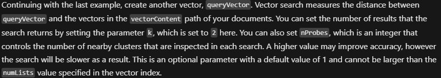

```json
db.C4_HNSW_COS.aggregate([
  {
    $search: {
      "cosmosSearch": {
        "vector": queryVector3,
        "path": "text_v",
        "k": 5,
		"efSearch": 64
      },
    "returnStoredSource": true }},
  {
    "$project": { "similarityScore": {
           "$meta": "searchScore" },
            "document" : "$$ROOT.id"
        }
  }
]);
```


### Results

#### 1st Try

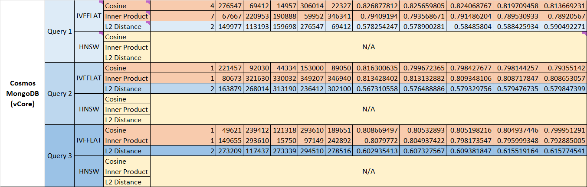

#### 2nd Try

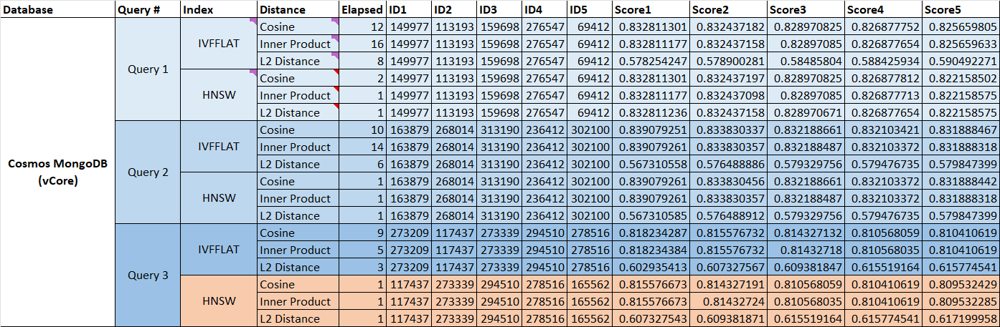

</br>

## Azure AI Search

Reference Doc: </br>
[Vectors in Azure AI Search](https://learn.microsoft.com/en-us/azure/search/vector-search-overview) </br>
[Create a vector store](https://learn.microsoft.com/en-us/azure/search/vector-search-how-to-create-index?tabs=config-2023-11-01%2Crest-2023-11-01%2Cpush%2Cportal-check-index) </br>
[Create a vector query in Azure AI Search](https://learn.microsoft.com/en-us/azure/search/vector-search-how-to-query?tabs=query-2023-11-01%2Cfilter-2023-11-01) </br>
[azure-search-vector-samples](https://github.com/Azure/azure-search-vector-samples) </br>

### Index and Vector Profile

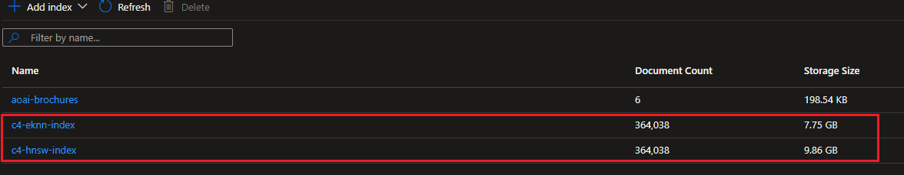 </br>
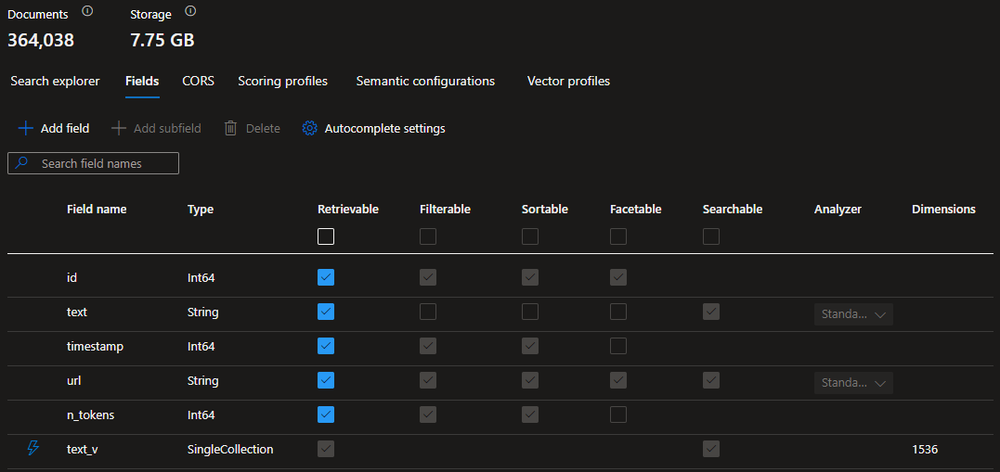 </br>
 </br>

### Query Vector

```json
{
    "count": true,
    "select": "id, text",
    "vectorQueries": [
        {
            "kind": "vector",
            "vector": [-0.0345621817,-0.0186467692,0.010800682,-0.0079248771,0.0052263481,0.0067561711,-0.0109713916,-0.0223498605,-0.0232953299,-0.0133153694,0.0057122144,-0.0079708369,-0.0254489016,-0.0140769975,0.0043826476,-0.0106037082,0.020340737,0.0004120017,0.0201306324,-0.0153507562,0.0238993801,0.0036243016,-0.0011170006,-0.0253175851,0.0001311101,-0.0220478345,0.0177669562,-0.0331177115,0.0310691949,-0.0147204427,0.0067299078,-0.0102163283,0.004366233,-0.0242014062,-0.0177406948,-0.0194740556,-0.0076294178,-0.0090541886,-0.0103213806,-0.0013714239,0.0323560834,-0.0119562559,0.0052788742,-0.0134007242,-0.0028856532,0.0115097845,0.0141557865,-0.0181083772,-0.0219559148,0.0390531644,0.0251994021,-0.0093693454,-0.0185154546,-0.0336429738,-0.0200387109,0.0240700897,-0.0205508415,0.0125143463,0.0081612449,-0.0298348311,0.0011990726,-0.0078001274,-0.0146416537,0.0080496268,0.0053510973,-0.0101309735,-0.0262893178,-0.0003227483,-0.0280489437,0.0252125338,0.0165851191,0.0111880619,0.0050162436,-0.0028167127,0.0036177358,-0.0322510339,-0.006647836,-0.0116739282,-0.0001587068,0.001861394,0.0302550402,-0.0261054765,-0.0199730545,0.0129148578,0.0055710506,-0.0066740988,-0.0355076492,0.0222316757,0.0075177997,-0.021299338,0.0137355784,0.0086274138,0.0135648679,0.0063523767,0.0026903218,0.0004300575,-0.0021059688,0.0343783386,0.0237418022,-0.0100653162,0.0090673203,0.0033649539,0.0035881901,-0.004175826,-0.0065920269,-0.0083056912,0.0049440204,-0.0003305452,0.0225074384,0.0001345982,-0.011069878,0.0272873156,0.01900132,-0.0562029369,0.0237418022,-0.0196972918,0.01057088,-0.0013443402,-0.0122320177,-0.0329601355,-0.0030054783,0.0301237255,0.0164669361,-0.0189619269,0.0095137917,0.0141951814,-0.0110239172,-0.0317257717,-0.0160467271,0.0135911312,0.0376612209,0.0305439327,0.0257377941,0.0204851832,-0.0030120441,0.0308853537,-0.0278913658,0.0221003611,-0.0189750567,0.0066806646,-0.0188174788,0.0137487091,-0.0278913658,-0.0013180771,0.0116476649,0.0167820919,0.0186467692,0.0005293647,0.0274974182,-0.0241357479,0.0083385203,-0.0275762081,0.0531038977,-0.0118512036,0.0206952877,0.0034929863,-0.0127638448,0.0261054765,0.0027379235,0.0190538466,0.0035684926,0.0099077374,0.0131577905,-0.0082662972,0.0063261134,0.0197760817,0.0007489074,-0.0161386468,-0.0153638879,-0.0095072258,0.0054758471,-0.0062177782,-0.0172942225,0.0098420801,0.0085945847,0.0337217636,0.0170709863,-0.0062932847,-0.0178588778,-0.0071895113,0.0113522056,0.0019369003,0.0136830518,-0.0115951393,-0.0242014062,0.0118249403,0.0099143032,0.0040576421,-0.0040674908,0.0096582389,0.0070975907,0.0007669633,0.0197366867,-0.0035258152,-0.6710736156,-0.0398673192,0.0048389682,0.0164275412,0.008502664,0.0184891913,0.0080758892,0.0033551054,-0.0121400971,0.0122320177,0.008391046,0.0040379446,-0.0032960135,0.0115032187,-0.0132628428,-0.0197104234,-0.0247923248,0.0002462161,-0.0229276475,0.0013188978,-0.0119759534,0.0321985073,-0.0067824339,-0.001849904,0.0017448517,0.0042086546,0.0187912155,-0.0112931142,-0.0222448073,0.0081481133,-0.0250286926,0.0350611806,0.0246347468,-0.0030875504,0.0570958816,-0.0166507773,-0.0272873156,0.035428863,0.0130067784,0.0569908321,-0.0165982507,-0.0067134937,0.003726071,-0.0105971433,-0.0060372199,0.0132037513,0.0204457883,-0.0012089213,0.0004001012,-0.0176356416,0.0135779995,-0.0025787037,-0.0000901767,0.0081612449,0.0073011294,0.0217326786,0.0096319756,0.0146416537,-0.0075243656,-0.0125012146,-0.0109779574,-0.006703645,-0.018462928,-0.0047010868,-0.0232559349,-0.0018548283,-0.0136305261,0.0048882114,0.0227306746,-0.0288105719,0.0039657215,0.0087062027,0.0017711148,-0.0134138558,0.020301342,0.008043061,0.0393683203,0.0116082709,-0.0352712832,-0.009270859,-0.0055382219,-0.0213649962,-0.0182002969,0.0089163072,0.0123567674,0.0087390319,-0.0209447872,-0.010380473,0.0135254739,0.0051475591,-0.0155214658,0.015665913,-0.0061554038,-0.0071107224,-0.0129411202,0.0235054344,-0.0040051159,0.0045500742,-0.0042480491,-0.0097238962,0.0040740566,-0.0044548707,0.0294146221,-0.0041462798,0.0090279253,-0.0059715621,-0.0059978254,-0.007123854,0.0396046862,-0.0001232107,0.0044417391,-0.0113128107,0.0003654258,0.0107021946,-0.0024424642,-0.0264206342,0.0156921763,0.018883137,0.0145759955,-0.0072683007,0.0165325943,-0.0134598156,0.0216538887,-0.0171497744,-0.0168083552,0.006263739,0.0037063737,-0.0035126836,-0.0154295452,0.0044220421,0.0174255371,0.0078066932,0.0273661036,-0.0254882947,0.0263812393,-0.0176881682,0.016086122,0.000226724,0.0280226804,-0.0361117013,-0.0224943068,-0.0043235556,0.0052132164,0.0112668509,0.0064804088,-0.0265519489,-0.0098026851,-0.009421871,-0.0200649742,0.0172679592,-0.0330389254,0.0169265401,-0.0156527814,0.0087981233,0.0151800457,-0.0117789805,0.0136699202,-0.008502664,-0.0370046459,-0.0271297358,0.0022093796,0.0091723725,-0.0133613292,-0.0153507562,0.0302287769,-0.0446471944,0.01976295,0.0215751007,0.0168477502,-0.0300711989,-0.0091855032,-0.0009282349,0.0060503515,0.0059354506,0.0084895324,0.0093693454,-0.0053576631,-0.0064016199,0.0228619892,-0.0011900447,0.0069334465,0.0094284369,-0.0269984212,0.0084895324,0.0129673835,0.0274186302,0.0212468114,0.0240306966,0.0006631421,0.0114966528,-0.026657002,0.0185154546,-0.0068021314,-0.0125012146,0.0297035165,-0.0190144517,0.0121663604,0.0143396286,0.0083253887,0.0289156232,0.0088834781,-0.0017957364,0.001632413,-0.0068612234,0.0056170109,-0.0158366226,-0.0054463013,-0.0316207185,0.0243852474,0.0150618628,0.0053937752,-0.0282065216,-0.0377662741,-0.0211680233,-0.0155214658,0.0333803445,-0.001550341,0.0067134937,-0.0127113191,-0.0130396066,-0.0049308888,-0.001693967,-0.00378188,-0.0092642931,0.0035684926,0.0082794279,0.0208659973,0.0376086943,0.0153507562,-0.0218639933,-0.0173336174,0.0035028351,-0.0078789163,0.0151012568,-0.0054627154,-0.0245034304,-0.0003211069,-0.0245559569,0.0222842023,-0.0067200596,-0.0036308675,-0.0038967808,0.009041057,-0.0092839897,0.0014379023,-0.0003297245,0.0065263691,0.0303338282,-0.0300974622,0.0012680131,-0.0201306324,0.0243852474,-0.0053707948,-0.0132628428,-0.011529481,-0.0273661036,0.0045303772,0.0042250692,0.0187912155,0.0385279022,0.0227175429,0.0031860368,-0.0047733104,-0.0111224037,0.0301237255,0.0028396929,0.0143527603,0.0073602214,-0.0050687697,-0.0108663393,0.025514558,0.0037917285,0.0034732891,-0.0076359832,-0.012717885,-0.0083253887,0.0111027071,-0.0201700274,0.0134269875,0.0066117244,0.0029184821,-0.0146153904,0.0102688549,0.0193296093,-0.0123633333,-0.0115229152,0.0026115326,-0.0183053501,-0.0200518426,0.0129279895,-0.0003369058,0.0235448293,-0.0068349601,-0.0107875504,-0.0116017051,-0.0065821782,0.019460924,-0.0223235972,-0.005610445,0.0083582178,0.009041057,-0.0090213595,0.0124158598,-0.0413380489,0.0239256434,0.0140376035,-0.0022290768,-0.0202619471,0.0050392239,0.0133219352,-0.0136567885,-0.0230720937,-0.039762266,-0.0012548816,-0.0006615007,0.0107350238,-0.0030694946,-0.0371359587,0.0303863548,0.0146547854,-0.0194477923,-0.0046058833,-0.027654998,0.0168740135,0.1030562297,0.0123108076,0.0120219132,0.0226912796,-0.0214437842,-0.0119956508,-0.0196578968,-0.0342732891,0.00812185,-0.0131643564,0.0070844591,-0.0010201556,-0.0022930931,-0.0037785971,0.0314368792,0.0005408548,-0.0021043273,-0.001753059,-0.0215619691,-0.009270859,-0.01057088,-0.0036472818,-0.0078460881,0.0292570442,-0.0059452993,-0.0164931994,0.0027970155,0.002672266,0.0338530801,-0.0167952236,-0.0042743124,-0.0049276059,-0.018462928,-0.0091592409,-0.0103542097,0.0327500291,0.0153113613,0.0234529078,0.0198680013,-0.017504327,0.0040051159,0.0100193555,0.0046222978,-0.0130264759,-0.0015043806,-0.0101244077,-0.0078986138,0.0109451283,0.0019845022,-0.018883137,0.0165982507,0.0110830097,-0.0242014062,-0.0082465997,-0.0021929652,0.0406552106,0.0179507993,0.0062309098,-0.0110764438,0.0034798549,-0.002430974,-0.0357177556,0.0102688549,-0.0055677677,-0.0186992958,-0.0384753756,0.0009594223,-0.001153933,-0.0113259424,-0.0130461724,0.0013599339,-0.0017661905,-0.02535698,0.008391046,0.0111617986,0.004001833,0.0146022588,-0.0219296515,-0.0200255793,0.0174124055,0.0027970155,-0.0057319119,0.0189881884,0.0078789163,-0.0093890419,0.0288630985,0.0247923248,-0.0059912596,-0.0117855463,-0.0121138347,0.0103148147,-0.0136305261,0.0333540812,-0.0224286485,0.0093233846,-0.0214175209,0.0186599009,0.0048914943,-0.0001642467,0.0261054765,0.0189881884,-0.0060273712,-0.0233478565,-0.0039821356,0.0074915364,0.0098420801,0.0238074604,0.0261054765,-0.0223104656,0.0124815172,0.0183053501,-0.0241882745,0.0182002969,0.0038770835,-0.0157972276,0.0176356416,0.0065854611,0.021299338,0.0010677574,-0.0187255591,0.0110042207,-0.0187518224,0.0006984331,-0.0038344061,0.0013993285,-0.0014428266,0.0055316561,-0.0316732451,-0.0123567674,0.0059452993,0.0109713916,0.0261186082,-0.0023538263,-0.0177012999,-0.0087981233,-0.027234789,-0.0033649539,0.0154820709,0.0005314165,-0.046695713,-0.0162962265,-0.0038147089,-0.0062965676,-0.005344532,-0.0208003391,-0.0125406086,0.0047831591,0.0237024073,-0.018462928,-0.0007008953,-0.0285742041,-0.0003403938,-0.0019877851,0.0159285422,-0.0009750159,-0.0348248109,-0.0237418022,-0.0154426768,0.0136436578,-0.0015782455,0.0215094425,-0.0047010868,0.0252256654,0.0011785546,-0.0062013641,0.0080561927,-0.0066347043,0.0105511826,-0.0307540372,0.0106956298,0.0106299715,0.0075046681,-0.005305137,-0.0192639511,-0.0060634827,0.0171103813,0.0066806646,-0.0112208901,-0.026893368,-0.0286004674,0.019881133,-0.0174124055,-0.0073864842,-0.0014313365,0.0055382219,0.000340599,0.0211680233,-0.0138012357,0.0000707871,0.0055480707,0.0290469397,0.0050654868,-0.0087455977,-0.0039493069,0.0099471323,-0.020340737,-0.0001847647,-0.0040051159,-0.0074455761,0.0129936468,-0.007202643,0.009382477,-0.0045730546,-0.0004501652,-0.0107941162,0.0429138318,-0.0176093783,-0.0160073321,0.0245428253,-0.0134204216,-0.0155739915,0.0007813259,-0.0118118096,-0.0267357901,0.0300449356,-0.0026755487,-0.0114506921,0.024516562,-0.0299398825,0.003103965,-0.0026624172,-0.0221660193,0.0120941373,-0.0014264123,0.0234135147,0.0113784689,-0.005859944,-0.0165851191,0.0140113402,-0.016204305,-0.0099733956,0.0269458946,0.0446209311,-0.0199730545,0.0084435726,-0.0005662972,0.013328501,-0.0179901924,-0.0199730545,0.0326712392,0.0252913218,0.0203801319,0.0031597738,-0.0312005095,-0.004671541,0.0237680655,-0.0135517363,-0.0196316335,-0.0200124476,-0.0097764228,-0.0169002768,0.0150093362,-0.0159285422,0.0129017262,0.003755617,-0.0261186082,0.0025146876,-0.0271297358,-0.0197104234,-0.0097370278,-0.0092839897,0.0609828159,-0.0063458108,-0.0093693454,-0.0011112555,-0.0019762949,-0.0007919953,-0.0057187802,-0.0171366446,0.0270772111,-0.0060602003,0.007373353,-0.0095925806,0.0019697291,0.0026312298,0.0120810056,-0.0031548496,-0.005955148,-0.0075440626,-0.0121926237,0.0111617986,0.0102819866,-0.0063195475,0.0115623102,-0.0312267728,-0.0105774458,-0.012258281,-0.0074652736,-0.0041495627,-0.0297035165,-0.0199467912,0.0007657322,-0.0283640996,0.0120613081,-0.0025425921,-0.0084567042,0.0137355784,0.0228488576,-0.0206427611,0.0202750787,0.0148911523,0.0150749935,0.0215619691,0.004231635,0.006647836,-0.0250024293,0.0200387109,-0.0047109355,0.0148517583,0.0037621828,-0.0141951814,0.0103936046,-0.0066609676,0.0158760175,0.0157972276,0.0088309525,-0.0325399265,-0.0045238114,-0.0351137035,0.034746021,-0.0212336797,0.0052690255,0.0207084194,0.0004497548,-0.0062604561,-0.0074915364,0.0083976118,-0.0058205496,-0.0080036661,-0.0041265828,0.018042719,0.0293883588,0.0060766144,-0.0240700897,0.0042775953,0.0118315062,-0.003726071,0.020721551,-0.0093299504,0.0088900439,0.0045894692,0.0407865234,0.0085223615,-0.0027789595,-0.0076491148,-0.0144972065,0.0150224678,-0.0326712392,-0.0325136632,-0.0295459367,-0.0225730967,0.0234003831,0.0037950114,0.0116082709,-0.04795634,-0.0121007031,-0.0330126621,0.0089950962,-0.0223367289,-0.0052132164,0.018344745,-0.012067874,-0.0069597098,0.0203670003,-0.007314261,0.0148386266,-0.024516562,0.0058697928,0.01762251,0.0034240459,-0.0006446759,0.0050687697,-0.014365891,-0.008391046,-0.0045238114,-0.0004780697,-0.0013763482,0.0074324445,-0.0209316555,-0.0259478986,0.0019434661,0.0035028351,-0.0090541886,0.0102228941,-0.0111880619,-0.0338793434,-0.0271034725,-0.0094153052,0.0002121562,-0.0279176272,0.0215225741,0.0285216775,0.0001888683,-0.0097632911,-0.0100127896,-0.0173730105,0.0175568517,-0.0251731388,0.0117395855,0.0122057553,0.0323298201,0.006529652,-0.007314261,-0.0113456398,-0.0185417179,-0.0190275833,-0.0088243866,-0.0067824339,0.0134204216,0.0086602429,-0.0002638616,0.0038967808,0.0145103382,-0.0265650805,-0.0049374546,0.0127047533,-0.0105643142,0.0058336812,-0.004310424,0.0054594325,0.0002987423,0.0213912595,-0.0234791711,-0.0274711568,0.0044515878,-0.0071369852,0.0119037302,-0.0234135147,-0.020183159,0.0161911733,-0.0023866552,-0.0056301425,-0.0071369852,-0.0034043486,0.0023620336,0.0232428033,0.2405695915,0.0046879556,-0.0159285422,0.0044417391,-0.0003623481,0.0327237658,0.0133416317,-0.0123764649,0.0075112339,0.0030793434,-0.0251074806,0.0125471745,0.010840076,-0.00227832,-0.0017333616,-0.0174386688,-0.0221528877,-0.0049670003,-0.0355076492,-0.0013394158,-0.0108466418,0.0176619049,0.011798678,0.0035684926,0.0275762081,0.0070647621,-0.0019845022,0.0125274779,-0.0005441377,0.0205902364,-0.0066281385,-0.0139325513,-0.003361671,0.0153244929,-0.0051508415,-0.0072879978,0.0177932195,0.0016250266,-0.0044876998,0.0165719874,-0.0032878062,0.0053543802,-0.0113325082,-0.005705649,0.0090935826,0.0230720937,-0.0040182476,0.00846327,-0.0116345333,0.014864889,-0.0186861642,0.0010882753,0.0327237658,0.0195528455,0.0064574289,-0.0096057123,0.0207740776,0.0099930922,-0.0213256013,-0.0136042628,0.0000400614,0.0255276896,-0.0183184817,0.0034929863,0.0092380298,0.0187255591,-0.0281277318,-0.0019746535,0.0189356636,-0.0421522036,0.0029726496,0.0037129396,-0.0054266038,-0.0058566616,-0.0180689823,-0.0319096111,0.0292833075,0.0133219352,0.0151931774,0.0127638448,-0.0211417601,0.0130002126,-0.0019762949,0.0037096567,-0.0259741619,-0.030990405,0.0141951814,-0.0038836494,-0.0223367289,0.0084567042,0.0143002337,-0.004615732,-0.006398337,0.0016857599,0.0082991254,0.0116804941,0.002613174,0.000711975,0.0024802173,-0.0046879556,-0.011417863,-0.0039788531,0.0203932617,0.0228357259,-0.0117527172,-0.0067627369,0.0028528245,-0.0042217863,0.0121400971,-0.0131643564,-0.0164012779,0.0000580147,0.0151406517,0.0047076526,0.0167952236,-0.0117330197,-0.0125668719,-0.0376349576,-0.0083844801,-0.0115885735,-0.0071172882,-0.009730462,-0.0167820919,0.0234397762,-0.0044417391,-0.0091132801,0.0021502876,0.0072879978,0.017202301,-0.0429926217,0.0093890419,-0.0264994223,0.0307803005,-0.0162174366,0.0005002291,0.0187518224,0.0279176272,-0.0026788316,-0.010610274,0.0058041355,-0.003361671,-0.0007037678,0.0050622039,-0.0054430184,0.0082203364,-0.0136173945,0.0250024293,-0.0011514708,-0.0234529078,0.0135648679,-0.0156265181,-0.0164800677,-0.0165851191,0.0087521635,0.0312005095,-0.0111027071,-0.0300186723,-0.0291257277,0.0057745893,0.0297560412,-0.0349036008,-0.0121335313,0.018502323,-0.0246610083,-0.0272085257,-0.0046551265,-0.1697643846,0.0022684715,0.0192770828,-0.0264731608,0.0245296936,0.0104855252,0.0006479588,0.0007345448,-0.0151669141,0.0115032187,0.0097107645,0.0318833478,-0.0165719874,0.0131249623,0.0087127686,0.0059157531,-0.010150671,0.0185417179,0.0234397762,0.0114441263,0.0265125539,-0.0102688549,-0.0106693665,0.0013541888,-0.0053839264,0.0035849072,-0.0196185019,-0.0080693234,-0.0076950751,-0.0048356852,-0.0237811971,-0.0060995948,0.0299924091,-0.0008707845,0.0111749303,0.0004399062,-0.0033846514,-0.003447026,-0.0142214447,0.0278651025,-0.0084107434,0.0116214016,0.0095991464,0.0061389892,-0.012717885,0.0249236394,-0.0036177358,0.0061061606,-0.0058271154,-0.0238862485,0.0039755702,-0.0359278582,0.0295196734,-0.0044286079,0.0314106159,0.0330914482,0.0183184817,-0.0006106161,0.0125077805,-0.0120087825,-0.0263024494,-0.0025590064,0.0188306104,-0.0141032608,-0.0023571092,-0.0143790226,-0.0058107008,0.0224417802,-0.0240306966,0.0119693875,-0.01057088,-0.0137749724,0.0023620336,-0.0334328711,0.0002985371,0.0019352589,-0.0111289695,-0.0068086972,-0.0047995732,0.0106628006,-0.0089294389,0.0469583422,-0.0054364526,0.0131052649,0.0100850137,0.0151931774,0.0242670625,0.0038836494,-0.0018827328,0.0034667233,0.0128426338,-0.0215751007,-0.0106037082,-0.0057942867,0.0070778932,-0.0018252824,0.013446684,0.003946024,-0.0010259006,-0.0132168829,-0.0132365804,-0.0029431037,-0.0265782122,0.0050162436,-0.0137487091,0.0124618197,0.0199861843,0.0036243016,0.0250286926,-0.0204851832,-0.0035881901,0.0004251332,0.0121729262,0.0058796415,-0.0000073993,0.0190275833,0.0144972065,-0.0043268385,0.0136305261,0.0036899592,0.0424936228,-0.0053773606,-0.011568876,-0.0102228941,0.0098355142,-0.023518566,-0.0675485805,-0.0059846938,0.013866893,0.0110042207,-0.0117001915,0.0302813035,0.0096057123,0.0220347028,-0.0387380086,-0.0050523551,-0.0101244077,0.0067627369,0.0054824129,-0.0117724147,0.0362167545,0.0022799615,-0.0077476013,-0.0423097834,0.0130855674,0.0120547423,0.0033649539,-0.005728629,0.0170972496,-0.0310954582,-0.0052427626,0.0027641866,-0.0379501134,0.0021535705,0.0041922401,0.003476572,0.00950066,-0.0116476649,0.014864889,-0.0178326145,-0.0294408854,0.0042447662,-0.0317782983,0.015744701,0.0060569174,-0.0335379206,0.0140244719,0.0049473029,0.0209447872,-0.0141295241,0.0214831792,-0.0065427837,-0.0340106562,0.0076359832,0.0032910891,-0.0485078618,-0.0183578767,-0.0307540372,-0.0115557443,0.0040510762,0.035849072,-0.0114638237,0.0241357479,0.0093365163,-0.02183773,0.0036275845,-0.0003933303,-0.0081940731,0.0070122359,0.0125800036,0.0028659559,0.011989085,-0.0053215516,-0.0199599229,0.0203670003,0.0072486033,-0.0049604345,0.0175962467,-0.0068349601,0.0062670214,-0.0236498807,-0.0275762081,-0.0343520753,-0.0225468334,0.0276287347,-0.0179639291,-0.0104133012,-0.0267095268,0.0191326365,-0.0034076315,0.0146679161,0.0131577905,0.0096122781,-0.0071304194,0.0086339796,-0.0076294178,0.023019569,0.0023997866,0.0197498184,-0.0196447652,-0.0089557022,0.0070647621,0.0004015375,-0.016204305,-0.0097435936,-0.0018728841,-0.0226912796,-0.0059715621,-0.0840417743,0.0125406086,0.0048520993,-0.0111224037,-0.0077738645,-0.0015232572,0.0114441263,-0.0224286485,-0.0066150073,0.011838072,-0.0262630563,0.0032516946,-0.0102228941,0.0106299715,-0.0414431021,-0.0047798762,-0.0024802173,0.0133875925,0.0075440626,-0.0066150073,0.0000544753,0.0016603175,-0.0156396497,0.0070647621,-0.0015421337,0.001306587,0.0014411851,0.0094481343,-0.0087652951,0.0088440841,0.0257115308,-0.0279176272,-0.0016168193,0.0157972276,-0.0053412491,-0.0310429316,0.0120022167,0.0113587715,0.0260660835,0.0179770608,0.0000165426,-0.0073011294,0.0279964171,0.0172942225,-0.0172154326,-0.0052394797,0.0030662117,0.0100784479,0.007202643,-0.0183841381,0.0135517363,0.023518566,0.001265551,-0.009001662,-0.0069662756,-0.0156921763,0.0368995927,-0.0083056912,-0.0033058622,-0.016742697,0.039105691,0.023636749,0.024437774,0.0170972496,0.0169396717,0.0071304194,-0.021299338,0.0049899807,-0.0000969476,-0.0115360469,-0.0018991472,-0.0266044755,0.0125603061,0.0363218039,-0.0083713485,0.0130067784,0.018581111,0.0007690151,-0.0195003189,0.0136042628,0.0127375815,0.013906288,-0.034325812,0.013446684,-0.0018072265,0.0054692812,-0.0126062669,-0.0034338946,0.0179639291,0.0219427831,-0.0202750787,0.0020911959,0.0063490937,-0.0001426002,-0.006033937,0.0267883167,-0.0206427611,0.0013640374,0.0163224898,0.0133810267,0.0080233635,-0.0132168829,-0.0262105297,-0.0233741198,-0.0307015125,0.0039985501,-0.0099340007,-0.0129017262,-0.0093299504,0.0107809845,0.0122976759,0.0126325293,-0.0097829886,0.0270509478,-0.009041057,-0.0112865483,-0.0027838838,-0.0162830949,-0.0264468975,-0.0101572368,0.009651673,0.002375165,0.0210629702,-0.0264075026,0.0006036399,0.0103542097,0.0089163072,-0.0169396717,0.0329863988,-0.0021371562,0.0076885093,0.008043061,0.0015774248,0.0006331858,-0.0079774028,0.0086011505,0.0011112555,0.0255539529,-0.0249630343,0.0531038977,0.0160073321,-0.0133613292,0.0068349601,-0.0148517583,0.0016422616,0.0066248556,0.0009298763,-0.0126587925,0.0072617349,0.0140376035,-0.0045960345,-0.0103936046,-0.0176356416,-0.0321197174,0.0010611915,-0.0201568957,0.0051278616,0.0105511826,0.0072157746,0.0301762503,0.0021831165,0.0370834358,0.0115951393,0.0035455124,-0.0170709863,0.0094678318,-0.0086208479,0.0143133653,-0.0310691949,-0.0276287347,0.005364229,-0.0130396066,-0.0030317414,-0.0011005861,-0.0048356852,-0.0176356416,0.0096057123,-0.0101441052,0.0230064373,-0.0125406086,-0.0007764016,-0.0071041565,-0.0344046019,0.0357965454,-0.0052033677,-0.0262105297,0.0103542097,0.0047831591],
            "exhaustive": true,
            "fields": "text_v",
            "k": 5
        }
    ]
}
```

### Results

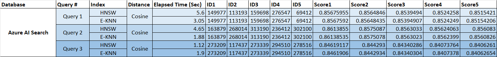
</br>

</br>

## Summary

### What are your options when choosing a vector search in Azure?

A vector database is a type of database that stores and retrieves data in the form of vectors, which are arrays of numbers that represent features or attributes of objects. Vector databases are often used for applications that require fast and accurate similarity search, such as image retrieval, natural language processing, recommendation systems, and machine learning.
In Azure, there are several options for choosing a vector database, depending on your needs and preferences. Some of the most common options are:

#### Traditional Relational Database

- Azure Database for PostgreSQL: This is a fully managed relational database service that offers high availability, security, and scalability. You can use Azure Database for PostgreSQL to store and query vector data using PostgreSQL extensions such as pgvector, which enables vector indexing and similarity search using various distance metrics.
- Azure SQL Database: This is a fully managed relational database service that offers high performance, security, and scalability. You can use Azure SQL Database to store and query vector data using features such as columnstore index, which enables columnar storage and compression for large vector data.

#### Distributed Relational Database

- Azure Cosmos DB for PostgreSQL: This is a fully managed and scalable service that provides compatibility with the PostgreSQL wire protocol and supports JSON and geospatial data types. You can use Azure Cosmos DB for PostgreSQL to store and query vector data using PostgreSQL extensions such as pgvector, which enables vector indexing and similarity search using various distance metrics.

#### NoSQL Database

- Azure Cosmos DB for MongoDB (vCore): This is another fully managed and scalable service that provides compatibility with the MongoDB wire protocol and supports BSON and geospatial data types. You can use Azure Cosmos DB for MongoDB to store and query vector data using MongoDB features such as vector field, which allows you to perform text search and cosine similarity on vector data.

#### Search Engine

- Azure AI Search (formally Azure Cognitive Search): This is a cloud-based search service that allows you to easily add sophisticated search capabilities to your applications. You can use Azure AI Search to store and query vector data using features such as semantic search, which leverages natural language processing and deep learning to perform semantic similarity and ranking on vector

### Vector Search Algorithm, Indexing and Similarity/Distance Calculation

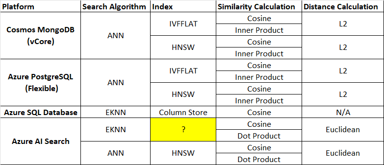 </br>

- **Azure Database for PostgreSQL & Azure Cosmos DB for PostgreSQL** </br>
By default, pgvector performs exact nearest neighbor search, which provides perfect recall.
You can query or add indexes with different distance functions you want to use.
  - IVFFLAT (Approximate Nearest Neighbor) and HNSW (Hierarchical Navigable Small Worlds)
  - L2 Distance, Inner Product and Cosine Distance are available with index.

- **Azure SQL Database** </br>
SQL Database doesn't have vector data type. However, you can pivot vector array into clustered columnstore indexed table.
 </br>
Cosign Similarity calculation is available with query. </br>
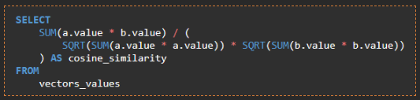

- **Azure Cosmos DB for MongoDB (vCore)**
  - IVFFLAT and HNSW (Preview)
  - L2 Distance, Inner Product and Cosine Distance are available with index.

- **Azure AI Search**
  - HNSW and Exhaustive KNN (K-Nearest Neighbors)
  - L2 Distance, Inner Product and Cosine Distance are available.
</br>

### Overall Results

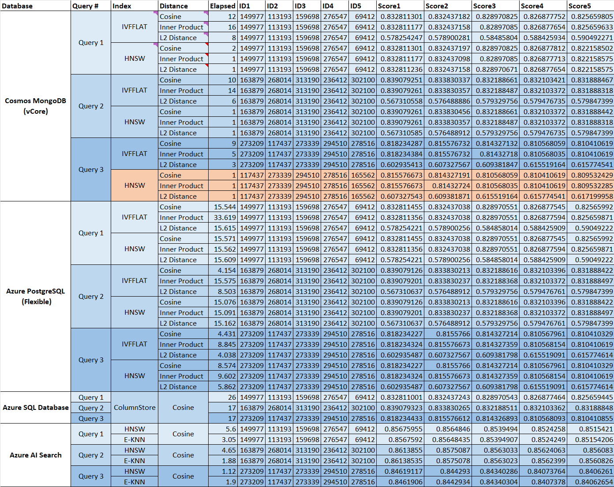